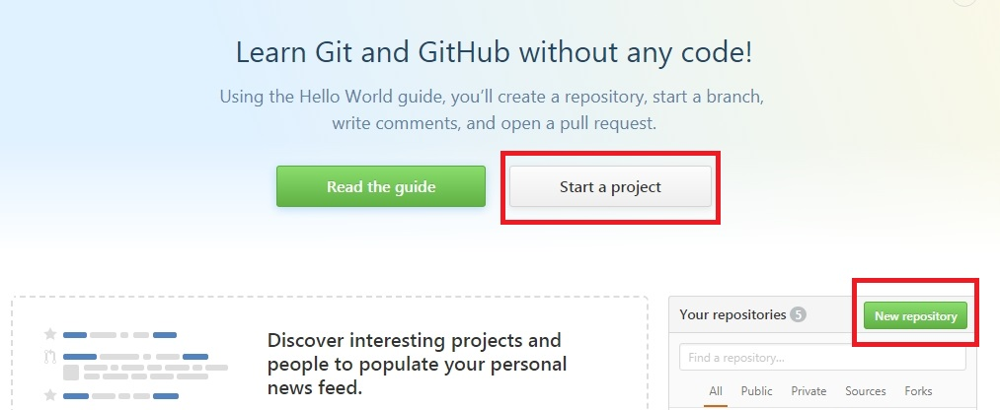
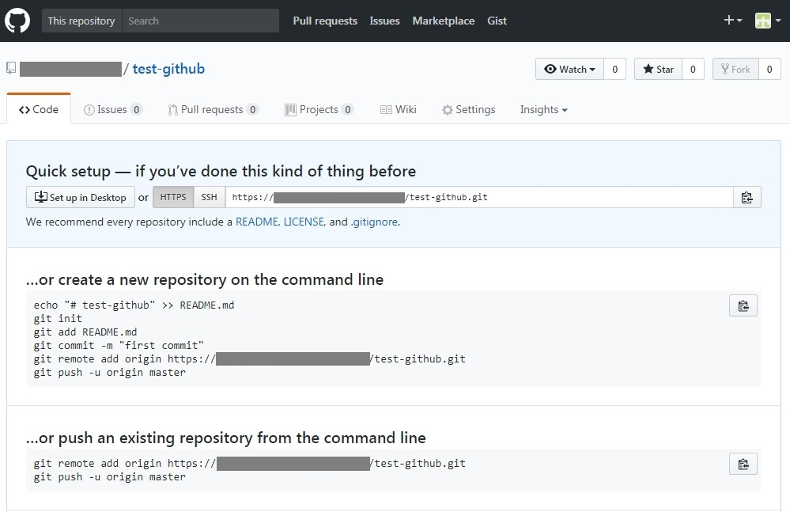
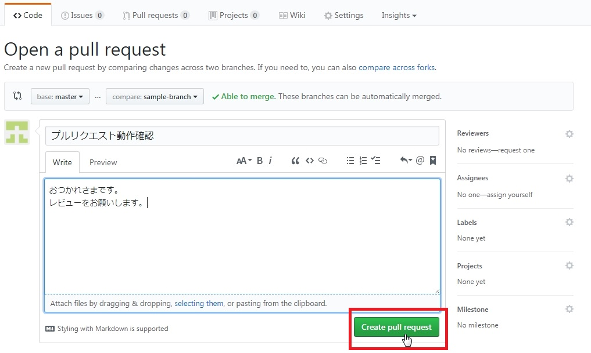

# 第3章　GitHub Enterprise環境構築

## 3-1. GitHub Enterprise 導入手順

FUJITSU Cloud Service K5 では、分散型のバージョン管理システム Git の
ウェブサービス[「 GitHub Enterprise 」](http://jp.fujitsu.com/solutions/cloud/k5/function/paas/github/)がご利用いただけます。

「 GitHub Enterprise 」と Jenkins などの CI ツールと組み合わせることで自動デプロイが可能な CI 環境が構築できます。

特に複数人が参加するチーム開発において「 GitHub Enterprise 」の利用は開発資産管理のフローを簡略化し、効果的な運用を実現できます。

本ガイドでは、効率的な資産管理を実現するワークフロー「 Github Flow 」を意識して CI 環境を構築していきます。

「 GitHub Enterprise 」全般に関する情報は [「 GitHub Enterprise 」ご紹介資料](http://jp.fujitsu.com/solutions/cloud/k5/document/pdf/k5-github-function-overview.pdf)　をご参考ください。

以下では、「 GitHub Enterprise 」のアカウント取得済みの前提で説明します。

-------------------------------------------------------------------------------------------------------------------

## リポジトリ作成方法

1.リモートリポジトリの作成

 「 GitHub Enterprise 」の画面で新規のリポジトリを作成します。
 
 トップ画面中央の [ Start a project ] を押下、または右下の [ New repository ] を押下します。（掲載画像 赤枠部分）
 
 
 
次画面に遷移したら「 Repository name 」を入力し、[ Create repository ] を押下でリモートリポジトリが作成されます。

 

サンプルとして「 Repository name 」を「 test-github 」として作成しました。

作成されたリモートリポジトリの初期画面です。




2.ローカルリポジトリの作成

 仮想サーバ上にローカルリポジトリを作成し、Gitリポジトリにします。

 先程作成したリモートリポジトリ「 test-github 」を利用して作成していきます。

```bash
# gitをインストール。
yum -y install git

# 作業用のディレクトリを用意し、中に入ります。
mkdir { ローカルリポジトリ名 }
cd { ローカルリポジトリ }

# 動作確認用に「 README.md 」を作成します。
echo "# test-github" >> README.md

# Gitリポジトリ化します。
git init

#「 GitHub Enterprise 」の画面で作成したリモートリポジトリ情報を登録します。
git remote add origin https://git-dXXXXrbo.jp-east-1.paas.cloud.global.fujitsu.com/ユーザ名/test-github.git
※注意：GitHub Enterprise のリポジトリ url の FQDN 部分はご利用者ごとに異なります。

（# ssh で接続する場合は）
（git remote add origin git@git-dXXXXrbo.jp-east-1.paas.cloud.global.fujitsu.com:ユーザ名/test-github.git)

# 「 README.md 」のファイルをインデックスに追加
git add README.md

# コミット
git commit -m "{ コミットのコメント記入 }"

# プッシュして ローカルリポジトリをリモートリポジトリへ反映させます。
git push -u origin master

#「 GitHub Enterprise 」に登録したユーザー名を聞かれます。
Username for 'https://git-dXXXXrbo.jp-east-1.paas.cloud.global.fujitsu.com/': 
ここにユーザ名を入力

# 続けて同じく登録したパスワードを入力します。
Password for 'https://ユーザ名@git-dXXXXrbo.jp-east-1.paas.cloud.global.fujitsu.com': 
ここにパスワード入力

```

「 GitHub Enterprise 」画面で確認

以下の url で確認。

`https://git-dXXXXrbo.jp-east-1.paas.cloud.global.fujitsu.com/ユーザ名/test-github.git`


動作確認用に作成した README.md が格納され、画面に「 test-github 」が表示されていれば完了です。

以上で開発資産管理の場として「 GitHub Enterprise 」の準備ができました。


## 3-2. Pull request と Merge

「 GitHub Enterprise 」による資産管理を行う上で欠かせない機能が「 Pull request 」と「 Merge 」です。

ここではチーム開発における効率的な資産管理を実現する Github の運用モデル「 GitHub Flow 」を意識して、
「 Pull request 」と「 Merge 」の基本操作を説明します。

「 GitHub Flow 」に関して詳しくは GitHub 公式ガイドの[「 Understanding the GitHub Flow 」](https://guides.github.com/introduction/flow/)ページを参照ください。

「 Github Flow 」では、1つのリポジトリに「 master 」ブランチと「開発用ブランチ」の2種類のブランチを切り、
各開発者がローカルで作業したものを「開発用ブランチ」へ push し、「 Pull request 」機能でレビュー依頼をします。

レビュー完了後、資産管理責任者が「 master 」ブランチへ「 Merge 」を行ってデプロイするという流れになります。

「 Github Flow 」に従ってリポジトリの運用を行うことで開発チーム内で効率的なソースレビューを行えるよう目指します。

-----------------------------------------------------------------------------------------------------

### ■ Pull request

Pull request は分散型のバージョン管理システム GitHub の最も特徴的な機能です。

複数人が参加するチーム開発において資産管理を Github で行った場合、各開発担当者は各自のローカルリポジトリで作業を行うことになりますが、
各開発者がローカルリポジトリで加えた変更を他の開発者に通知する機能が Pull request です。


**Pull request 手順**

リポジトリに Pull request 用のブランチを作成します。

ここでは「 sample-branch 」という名前でブランチを作成します。

```bash
# プルリクエストを行うリポジトリへ入ります。
cd { リポジトリのディレクトリ名 }

# ブランチ作成
git checkout -b sample-branch

# git branch コマンドで、存在するブランチの一覧を確認
git branch
  master
* sample-branch
※アスタリスク[ * ]がついているブランチが現在チェックアウトしているブランチです。

# ブランチが異なる場合は、利用したいブランチにチェックアウトします。
git checkout sample-branch
```

ブランチが用意できましたら「 Pull request 」動作確認用に作業します。

確認用のREADME.mdを作成します。

`echo "# sample-branch for Pullrequest" >> README.md`

作成した MD ファイルをコミットし、sample-branch ブランチへプッシュします。

```bash
# 作成した MD ファイルをインデックスに追加。
git add README.md

# コミットし「プルリクエスト動作確認」とメッセージをつけます。
git commit -m "プルリクエスト動作確認"

# sample-branchブランチへプッシュします。
git push -u origin sample-branch
```


画面で確認します。「 sample-branch 」へ push されたことが分かります。


上の画面の赤枠 [ Compare & pull request ] を押下して Pull request を作成します。

次画面に遷移しましたら、中央のテキストボックスにメッセージを記入し、[ Create pull request ] を押下すれば、Pull request の完了です。




遷移した画面で作成した Pull request の状態を確認することができます。


### ■ Merge

「 Pull request 」でレビュー依頼を受けた開発責任者は、レビューを実施後、問題なければ「 master 」ブランチと
「 Pull request 」のブランチ「 sample-branch 」を「 Merge 」し、開発資産の統合をはかります。

**Merge 手順**

まずは、各ブランチの差異を確認します。

「 Pull requests 」のページの [ Files changed ] タブを押下し、コミット内容をレビューします。

確認用に作成したREADME.mdファイルの状況が画面中央に表示されます。


レビューが終わりましたら [ Conversation ] タブを押下し、メッセージを記入し、[ Comment ] を押下します。


レビュー完了しましたので、[ Merge pull request ]を押下し「 Merge 」します。


 GitHub では「 Pull request 」の「 Merge 」の方法が画面から選択できるようになりました。
 
 [ Merge pull request ] ボタンをプルダウンしますと、3つの「 Merge 」方法が選択できます。

 


> [ Create a merge commit ]  
> デフォルトの「 Merge 」方法です。  
> Pull request したブランチに存在するすべてのコミットはマージコミットを経てベースブランチ（本ガイドでは master ブランチ）へ統合されます。


> [ Squash and merge ]  
> Pull request したブランチに複数のコミットがあった場合、それらを１つにまとめて１つのコミットとして master ブランチへ統合します。  
> Pull request の複数のコミットの履歴は master には反映されず、１つのコミットとして扱われます。  
> 細かな修正や追加で大量のコミットが発生した場合にそれらを1回のコミットとして扱うようなイメージです。  

> [ Rebase and merge ]  
> Pull request したブランチに存在するコミットをリベースして１つ１つ履歴を残して master ブランチへ統合します。  
> 分岐した作業履歴を分かりやすく一直線の作業履歴に変えるイメージです。  

詳しくは公式サイトの[ 「 About pull request merges 」](https://help.github.com/articles/about-pull-request-merges/)を参照ください。

[ Merge pull request ] を押下すると、最終確認のため [ Confirm ] ボタンが出現します。それを押すと merge 実行です。

 

上図赤枠「 Pull request successfully merged and closed 」と Pull request のマージが成功したことのメッセージが出現すれば完了です。

また、同じく赤枠の[Delete branch]を押下すると「 Pull request」で使用したブランチを削除することができます。

以上を踏まえて、開発チーム内で「 Pull request 」 と「 Merge 」を 効果的に行ってください。

[[第4章 JenkinsとGitHubの連携へ]](configuration.md)
