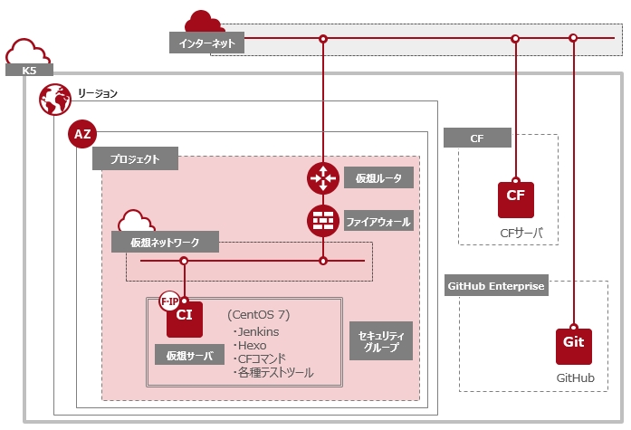

## 第1章 K5 IaaS環境構築

### 1-1.K5 IaaS環境構築について

本章では、K5上にCI環境を構築するための土台となるIaaS環境の構築を行います。

本ガイドでは以下の図のようなシステム構成を想定しています。

K5 IaaS 環境構築 手順は、以下のドキュメントをご確認ください。

- [『FUJITSU Cloud Service K5 IaaS ドキュメント・ツール類』](https://k5-doc.jp-east-1.paas.cloud.global.fujitsu.com/doc/jp/iaas/document/list/doclist_iaas.html)
- [『セルフサービス向けIaaS技術情報整備ガイド』](https://k5-doc.jp-east-1.paas.cloud.global.fujitsu.com/doc/jp/iaas/document/iaas_tutorial/index.html)

### 1-2.仮想OS CentOS 7 導入について

本ガイドでは仮想サーバのOSとしてCentOS 7を利用します。
K5提供OSより「CentOS 7.x (64bit) 英語版」がご利用できます。
K5が提供しているOSに関しましては[「FUJITSU Cloud Service K5 IaaS」](http://jp.fujitsu.com/solutions/cloud/k5/function/iaas/)ページよりご確認ください。

[[第2章 CIサーバ環境構築へ]](ci-server.md)
