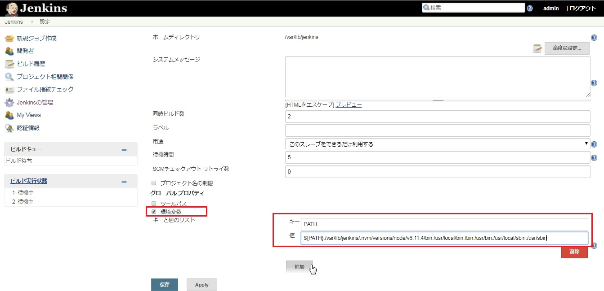
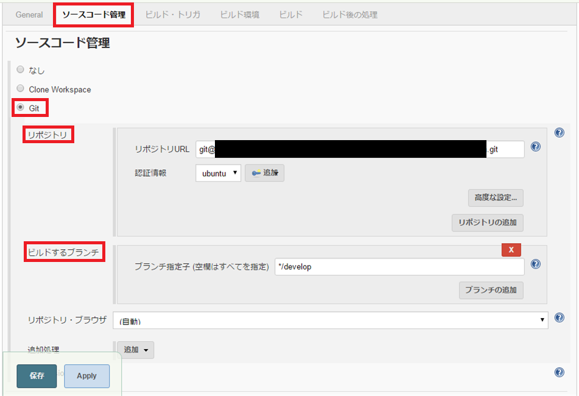
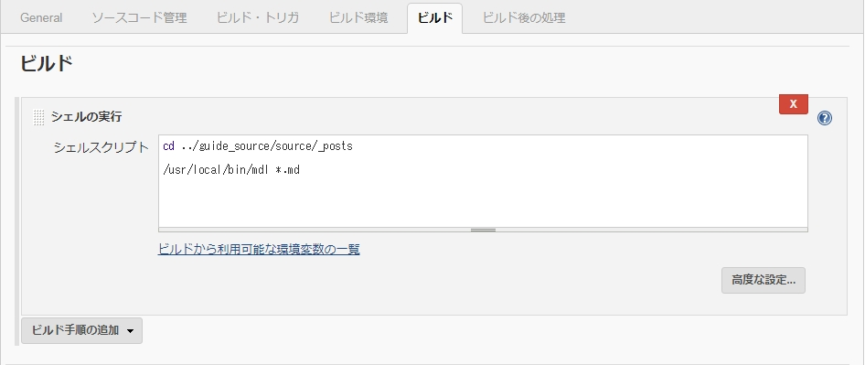
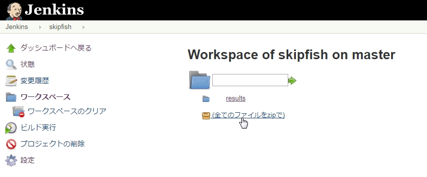
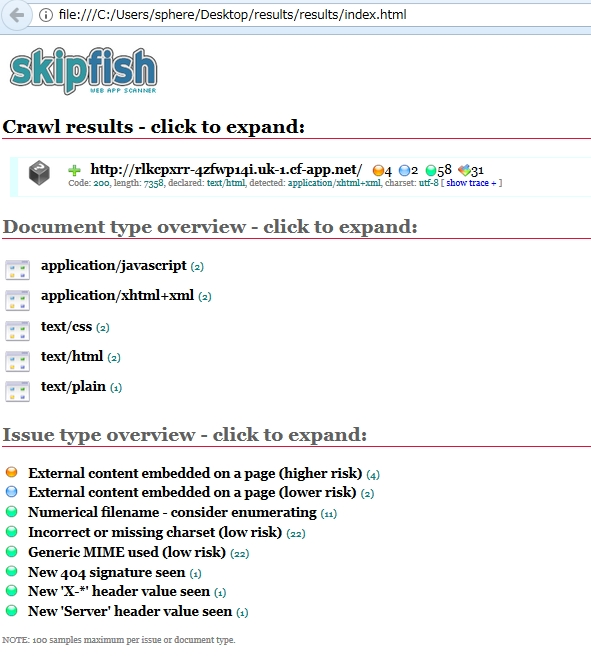
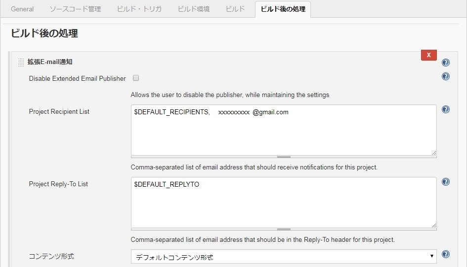
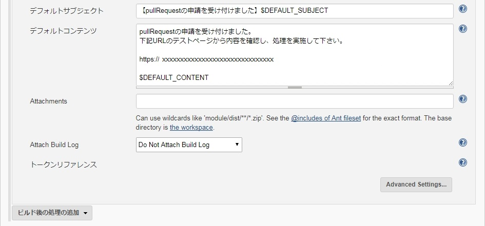

# 第7章 CI用Pipelineの設定

この章では[『想定利用シナリオ』](overview.md) に基づいて [Jenkins Pipeline](ci-server.md) を作成していきます。

大筋では『想定利用シナリオ』の各作業を Jenkins のジョブとして作成し、次にそれらを Pipeline でまとめ、
最終的には資産格納を契機に自動的に CI を実行できるような設定にします。

## 7-1. Jenkins のジョブの作成

[「2-2. Jenkinsの操作画面について ジョブ作成手順」](ci-server.md)を参考に『想定利用シナリオ』で必要なジョブを作成します。

『想定利用シナリオ』の中で Jenkins のジョブを作成する部分は具体的には以下の部分です。

 （ Pull request または Merge を契機に Jenkins の Pipeline が起動します。）

```
「GitHub Enterprise」から資産を取得しWorkSpaceに格納
↓
Markdown 構文チェック
↓
html ファイル生成（ブログ資産生成）
↓
html 構文チェック
↓
テストサーバへデプロイ
（Mergeの場合はステージングサーバへデプロイ）
↓
アタックテスト（脆弱性検査）実施
↓
成功時メール報告
↓
Mergeの場合は本番環境へデプロイ
```

資産格納先である「GitHub Enterprise」へ開発チームがPull requestを行うのか、
管理者がMergeを行うかでジョブが少々異なりますが、ほぼ同じジョブを繰り返す形になります。

### 事前準備

1．Hexo資産を作成し、「 GitHub Enterprise 」へ格納

本ガイドの Jenkins の設定を行う前提として、 Hexo の資産を「 GitHub Enterprise 」に格納します。

Hexo資産の作成は[「2-3. Hexo導入手順」](ci-server.md)で紹介した例を参考にしてください。

次に作成したHexo資産を「 GitHub Enterprise 」に格納します。

「 GitHub Enterprise 」にHexo資産格納用のリポジトリを作成し、Hexo 資産を作成したディレクトリをそのローカルリポジトリにします。

手順は[「3-1.GitHub Enterprise 導入手順」](github-enterprise.md)を参考にしてください。

資産格納の手順は以下の通りです。

```bash
# Hexo 資産を作成したディレクトリに入ります。
cd { Hexo 資産を作成したディレクトリ }

# gitリポジトリ化
git init

# ローカルリポジトリのファイルをインデックスに追加。
# 初回は全てのファイルをインデックスに追加して下さい。
git add .

# コミット
git commit -m "[コミットのコメント記入]"

# リモートリポジトリの追加
git remote add origin  https://git-dXXXXrbo.jp-east-1.paas.cloud.global.fujitsu.com/ユーザ名/リポジトリ名

# プッシュして ローカルリポジトリをリモートリポジトリへ反映させます。
git push origin master

```

以上で Hexo 資産が「 GitHub Enterprise 」のリポジトリに格納されました。

2回目以降はブランチを作成し、追加修正したファイルのみを格納していきます。

詳しくは[「3-2. Pull requestとMerge」](github-enterprise.md)を参考にしてください。

2．テストツールの実行コマンド

本ガイドでは Jenkins によって各テストツールを実行させていきます。

以下、[「2-3. Hexo 導入手順」](ci-server.md)で紹介したHexoコマンドおよび[「第6章 テストツールの導入」](test-tools.md)で紹介した各テストツールの実行コマンドが Jenkins ユーザから実行できるようパスが通っている前提で、Jenkins ジョブの作成を行います。

3．Jenkins 画面にて環境設定

Jenkins 画面でもパスの設定を行います。

まずは、仮想サーバ ( CentOS 7 ) のJenkins ユーザのパスを `echo $PATH` で確認してください。

確認したパスを Jenkins 画面に設定します。

Jenkinsの管理 ＞ システムの設定 画面に入ります。

【Jenkins システムの設定画面　環境変数設定】

 
 

 「グローバル プロパティ」欄の 環境変数にチェックを入れ、以下の部分を設定します。

項目        | 設定内容
:---------- | :--------------------------------
キー        | PATH
値          |  ${PATH}:  Jenkins ユーザのパスをコピー

値設定の例：  
${PATH}:/var/lib/jenkins/.rbenv/shims:/var/lib/jenkins/.rbenv/bin:/var/lib/jenkins/.nvm/versions/node/v6.11.4/bin:/usr/local/bin:/bin:/usr/bin:/usr/local/sbin:/usr/sbin

以上の事前準備ができましたら、各ジョブを作成します。

### 各ジョブの作成

**1．資産取得（GitHub Enterprise から WorkSpace へ資産格納）**

>開発資産を管理している「GitHub Enterprise」のリポジトリから資産を取得し、Jenkins の作業スペースである WorkSpace に資産を格納します。
>
>注意点は、
>
>   ・Pull request の場合と merge の場合で取得するリポジトリのブランチを変えること。
>
>   ・WorkSpace の内容を常に最新の状態にするため「ビルド開始前にワークスペースを削除する」を行うこと。
>
>の2点です。
>
>以下、設定手順
>
> 1. Jenkins で GitHub Enterprise 資産取得用のジョブを作成します。
>
> 2. [ 新規ジョブ作成 ]  →  [ フリースタイル・プロジェクトのビルド ] で任意の名前のジョブを作成します。
>
> 3. [ 設定 ] → [ ソースコード管理 ] タブ  →  [ Git ]を選択し、以下の項目を設定します。
>
> 
>
>   - リポジトリ：
>
>       - リポジトリURL
>
>         資産を取得する GitHub リポジトリのSSHを設定します。
>
>       - 認証情報
>
>         [「4-3. SSHの設定」](configuration.md) を参考に、認証情報を設定します。
>
>   - ビルドするブランチ：
>
>       - ブランチ指定子
>
>         取得する資産が格納されているブランチを設定します。
>
>         ※複数のブランチの設定やワイルドカードの仕様が可能。
>
>         ここでは、
>
>                開発チームが行う Pull request の場合 →「 */develop 」ブランチ
>
>                管理者が行う merge の場合 →「 */master 」ブランチ
>
>          を設定します。
>
> 4. [ 設定 ] → [ ビルド環境 ]   →  [ ビルド開始前にワークスペースを削除する ]にチェックします。
>
> これは WorkSpace 内に以前に取得した資産を残さず、常に最新の資産のみ保持するための措置です。
>
>
>
>設定が完了したら、左下の保存を押下し、完了です。


  次に取得した Hexo 資産を各種テストツールでテストしていきます。
  
  ここでは管理しやすいように資産作成と各テストごとにJenkinsのジョブを分けて作成します。

**2. Markdown 構文チェック**
>
> hexo で生成した .md ファイルをMarkdown構文チェックツール「 Markdownlint 」で検査します。
>
> 検査の対象になる .md ファイルは、以下の場所にあります。
>
> `workspace/{ 資産取得のジョブ名 }/source/_posts`
>
> 「 Markdownlint 」の実行コマンドは `mdl { .md ファイル }` です。
>
> 以上を踏まえて、Jenkinsのジョブを作成します。
>
>  [ 設定 ] → [ ビルド ] →  [ ビルド手順の追加 ]を押下し、プルダウンメニューから [ シェルの実行 ]を選択し、以下を記述します。
>
>```bash
>  cd ../{資産取得のジョブ名}/source/_posts
>  mdl *.md
>```
>
> 実際には「 Markdownlint 」の実行コマンド「mdl」は各自のパスの設定などにあわせて記述してください。
>
>【参考画像】
>
>※参考画像では、<資産取得のジョブ名>＝ guide_source　　実行コマンド「mdl」＝ /usr/local/bin/mdl 
>
>
>

**3. htmlファイル生成（ブログ資産生成）**
>
>    Markdown構文チェックを通過したMDファイルからhtmlファイルを生成します。
>
>    htmlファイル生成には `hexo generate` コマンドを実施します。
>
>    必要なnode_modulesが資産取得のジョブのワークスペースにはありませんので、シンボリックリンクで hexo 作業用ディレクトリから呼び出します。
>
>    先程と同じように、ジョブの設定 [ シェルの実行 ]のシェルスクリプトを以下のように記述します。
>
>    ```bash
>    cd ../{ 資産取得のジョブ名 }
>
>    # hexo generateコマンド実行にはnode_modulesが必要になります
>    ln -sf {hexo作業用ディレクトリ}/node_modules
>
>    hexo generate
>    ```
>


**4. html構文チェック**

>
>    `hexo generate` で生成したhtmlファイルはデフォルトでは
>
>    `workspace/{ 資産取得のジョブ名 }/public/`に格納されます。
>
>    この生成したhtmlファイルの構文チェックを「HtmlHint」ツールで実施します。
>
>    手順は同じくジョブの設定でビルドを[ シェルの実行 ]にして以下のように記述するだけです。
>
>    ```bash
>    cd ../{ 資産取得のジョブ名 }/public
>    htmlhint
>    ```

**5. テストサーバへデプロイ**
>
>    本ガイドではテスト用サーバとしてK5提供サービスの「 CF 」を利用します。
>
>    設定のビルドの[ シェルの実行 ]は以下のように記述します。
>
>    デプロイする資産であるhtmlファイルは `workspace/{ 資産取得のジョブ名 }/public` にあります。
>
>    ```bash
>    readonly APPLICATION_NAME={ アプリケーション名 }
>    cd ../{ 資産取得のジョブ名 }/public
>    cf api --skip-ssl-validation { APIエンドポイント }
>    cf auth { ユーザーID }{ パスワード }
>    cf target -o { 組織名 }
>    cf target -s { スペース名 }
>    cf push ${APPLICATION_NAME} -p ../{ 資産取得のジョブ名 }/public
>
>    ```
>   デプロイの確認は、ジョブの [ コンソール出力 ]に表示されたCFアップロード結果のURLで確認できます。

**6. アタックテスト（脆弱性検査）**
>
>    テストサーバーに格納したファイルに「skipfish」を利用してアタックテスト（脆弱性検査）を実施します。
>
>   ```bash
>   # 結果レポート格納用のディレクトリ作成
>   rm -rf results
>   mkdir results
>
>   # skipfish 実施
>   cd { Skipfishインストール先ディレクトリ }
>   # 環境変数に WORKSPACE を設定します
>    （※$WORKSPACE = /var/lib/jenkins/workspace/{ アタックテストのジョブ名 }/）
>   ./skipfish -o $WORKSPACE/results { CFアップロード結果のURL }
>
>   ```
>  ワークスペースは{ 資産取得のジョブ名 }ではなく、{ アタックテストのジョブ名 }のworkspaceを利用します。
>
>  このジョブのworkspace以下にresultsディレクトリが作成され、html形式の結果レポートが格納されます。
>
> 【参考：Skipfishの検査結果確認方法】
>
> Skipfishを実行したジョブの workspace で（全てのファイルをzipで）ボタンを押下し、zipファイルを取得します。
>
> 
>
> 取得した「results.zip」を展開し、index.htmlファイルをブラウザで開くと検査結果が確認できます。
>
> 【参考例：Skipfish 検査結果画面】
>
> 
>
> 検査結果の見方は Skipfish 公式サイト等でご確認ください。

**7.成功時メール報告**

>
>すべてのジョブが成功した場合に管理者へメールにて報告するためのジョブを設定します。
>
>[「第2章 拡張E-mail通知の設定」](ci-server.md)を参考に設定してください。
>
>手順
>
>[ 設定 ] → [ ビルド後の処理 ] → [ ビルド後の処理の追加 ]を押下し、プルダウンメニューから [ 拡張E-mail通知 ]を選択します。
>
>
>
>
>適宜設定項目を記述すれば完了です。
>

以上で各ジョブが準備できました。

## 7-2. Jenkins Pipeline の作成

作成したジョブをPipelineでまとめ、資産格納を契機に自動的にCIを実行できるように設定します。

ポイントは資産格納の「Pull request」と「Merge」を判断し、それぞれを契機にPipelineを実行させる点です。

**Pull request用のPipeline作成**

まずは、[「第2章 Pipeline作成手順」](ci-server.md)を参考に想定シナリオの「Pull request」のパターンを設定していきます。

手順
  - [ 新規ジョブの作成 ] → [ Pipeline ]を選択
  - [「4-2. WebHookの設定  」](configuration.md)を参考にWebHookを設定します。
  - ジョブの詳細設定画面でPipelineエリアにスクリプト記述

   「Pull request用 Pipeline」のScript 記述例

> ```js
>def p = env.payload.indexOf("action\":\"opened")
>if(p != -1){
>  node{
>      // 資産取得
>      stage('Pullrequest資産取得'){
>           build job: '{ 1.資産取得のジョブ名 }'
>      }
>      // Markdown 構文チェック
>      stage('MD構文チェック'){
>           build job: '{ 2.Markdown 構文チェックのジョブ名 }'
>      }
>      // htmlファイルを生成
>      stage('html生成'){
>           build job: '{ 3.htmlファイル生成のジョブ名 }'
>      }
>      // html構文チェック
>      stage('html構文チェック'){
>           build job: '{ 4.html構文チェックのジョブ名 }'
>      }
>  }
>     // 管理者認証（Pipelineの一時停止）
>     stage('管理者認証'){
>           input '続行しても大丈夫ですか？';
>     }
>  node{
>     // CF（開発）サーバ（テストサーバ）へデプロイ
>     stage('CF開発格納'){
>           build job: '{ 5.テストサーバへデプロイのジョブ名 }'
>     }
>     // アタックテスト（脆弱性検査）
>     stage('脆弱性チェック'){
>           build job: ' { 6.アタックテスト（脆弱性検査）のジョブ名 } '
>     }
>     // 成功時メール報告
>     stage('メール報告'){
>           build job: ' { 7.成功時メール報告のジョブ名 } '
>     }
>  }
>}
>
>```

解説

1.　payloadの判定

webhookが発生するとGitHub側からpayloadのパーラメータが送られてきます。

このパーラメータでwebhookが発生したイベントが「pull request」かどうかを判定しています。

```js
def p = env.payload.indexOf("action\":\"opened")
if(p != -1){
     ----- 省略 -----
}
```

2.　管理者認証stage

 管理者認証というstageを「CF開発サーバ（テストサーバ）へデプロイ」する前に設定しました。
 
 これは、Pipelineを一旦停止し、再開には管理者の認証を必要とするステップを加えています。
 
 `input 'メッセージ'` と記述することで、Pipeline画面もしくはコンソール出力画面に記述したメッセージとともに
「Proceed or Abort？」と選択肢が出現するようになります。

このStageで一旦停止した場合、メール通知する設定が行えますので、管理者の認証として利用できます。

例：inputで一時停止した際にメールを送信

```js
// 管理者認証（Pipelineの一時停止）
stage('管理者認証'){
  mail (to: '{ メールアドレス }',
        subject: "Job '${env.JOB_NAME}' (${env.BUILD_NUMBER}) is waiting for input",
        body: "Please go to ${env.BUILD_URL}.");
  input '続行しても大丈夫ですか？';
  }
```

**Merge用のPipeline作成**

mergeを契機に実行されるPipelineの記述もほぼ同じです。

異なるのは以下の点です。

- payloadのパーラメータの判定方法
- masterブランチから資産取得すること
- テストサーバとして CF (Staging）を利用すること


1.　mergeの場合のpayloadの判定

mergeの場合、payloadのパーラメータは以下で判断します。

```bash
def cl = env.payload.indexOf("action\":\"closed")
def cls = env.payload.indexOf("merged\":true")

if(cl != -1 && cls != -1){
     ----- 省略 -----
}
```


2.　masterブランチから資産取得する

merge用の資産取得ジョブでは必ずmasterブランチから資産を取得するように設定します。

3.　ステージングサーバの利用

mergeした資産は公開用になりますので、テスト環境は本番環境と同等のステージング環境で行います。

本ガイドでは CF（Staging）としてステージングサーバを利用します。

  「merge用 Pipeline」のScript 記述例

```js
def cl = env.payload.indexOf("action\":\"closed")
def cls = env.payload.indexOf("merged\":true")

if(cl != -1 && cls != -1){
  node{
      stage('merge資産取得'){
           build job: '{ 資産取得のジョブ名 }'
      }
      stage('MD構文チェック'){
           build job: { Markdown 構文チェックのジョブ名 }'
      }
      stage('html生成'){
           build job: '{ htmlファイル生成のジョブ名 }'
      }
      stage('html構文チェック'){
           build job: '{ html構文チェックのジョブ名 }'
      }
  }
      stage('管理者認証'){
          input '続行しても大丈夫ですか？';
      }
  node{
      stage('CF-staging格納'){
           build job: '{ CF-stagingへデプロイのジョブ名 }'
          }
      stage('脆弱性チェック'){
           build job: ' { アタックテスト（脆弱性検査）のジョブ名 } '
          }
     }
}
```

[[第8章 デモ実行と運用へ]](demo.md)
