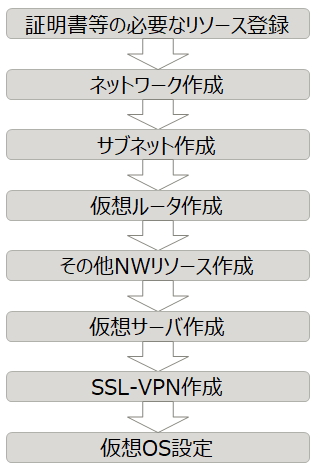

# IaaS システム構築自動化ガイド

## 概要

本ガイドは、Fujitsu Cloud Service K5 IaaS の仮想リソースの定義から
OSのセットアップを含めた、インフラの構築を自動で行う方法について、
サンプルを使用した具体的な実施手順を用いて説明しています。

## 対象読者

K5 IaaS におけるシステム構築の自動化を検討されている方

## 前提

- 以下の知識を有しているものとします。
  - 仮想化技術（ハイパーバイザ、仮想サーバ、仮想ストレージ、仮想ネットワーク）に関する基本的な知識
  - OpenStack(特にオーケストレーション)に関する基本的な知識
  - Linuxに関する基本的な知識
  - Ansibleに関する基本的な知識
  - ネットワークに関する基本的な知識

- APIで提供されていないサービスについては、環境自動構築の対象外としています。具体的には以下になります。
  - 専用物理サーバ
  - 専用物理ストレージ(専用物理サーバのオプション)
  - Trend Micro Deep Security as a Service
  - プライベート接続機能

- 本ガイドは東日本第1リージョンを想定しています。その他のリージョンについては、APIの動作に違いがある場合があります。

- 本ガイドではリージョンを跨いだ環境自動構築について、考慮外とします。

- 本ガイドではオートスケーリングを含んだ環境自動構築について、考慮外とします。

- 本ガイドではIPsecサービスを含んだ環境自動構築について、考慮外とします。

## 注意事項

実装例やサンプルファイルは自己責任での利用をお願いいたします。

## 参考資料

- FUJITSU Cloud Service K5 IaaS 機能説明書
- FUJITSU Cloud Service K5 IaaS API リファレンス
- FUJITSU Cloud Service K5 IaaS API ユーザーズガイド
- FUJITSU Cloud Service K5 IaaS Heat テンプレート解説書

## 使用サンプル

本ガイドで使用している[サンプル](sample/)をダウンロードできます。

## 手動環境構築手順

本ガイドで自動構築対象となるK5上での一般的なインフラ構築手順を以下に示します。

本ガイドでは上図の手順を自動的に実行する為の仕組みの説明と実装サンプルを提示します。

なお、実装サンプルの自動実行に際しては、Heatテンプレートの用意や実行時の設定等が必要になっています。以降では、上図の流れに沿って環境の自動構築について述べていきます。
