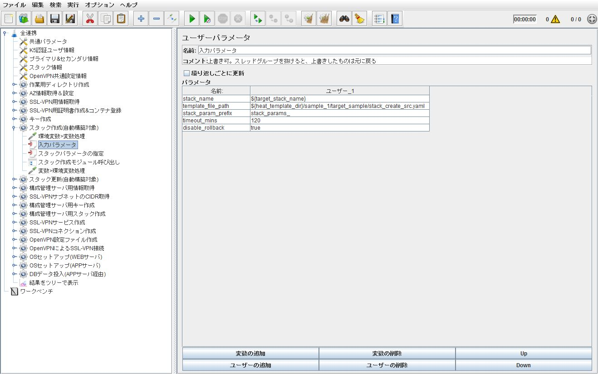
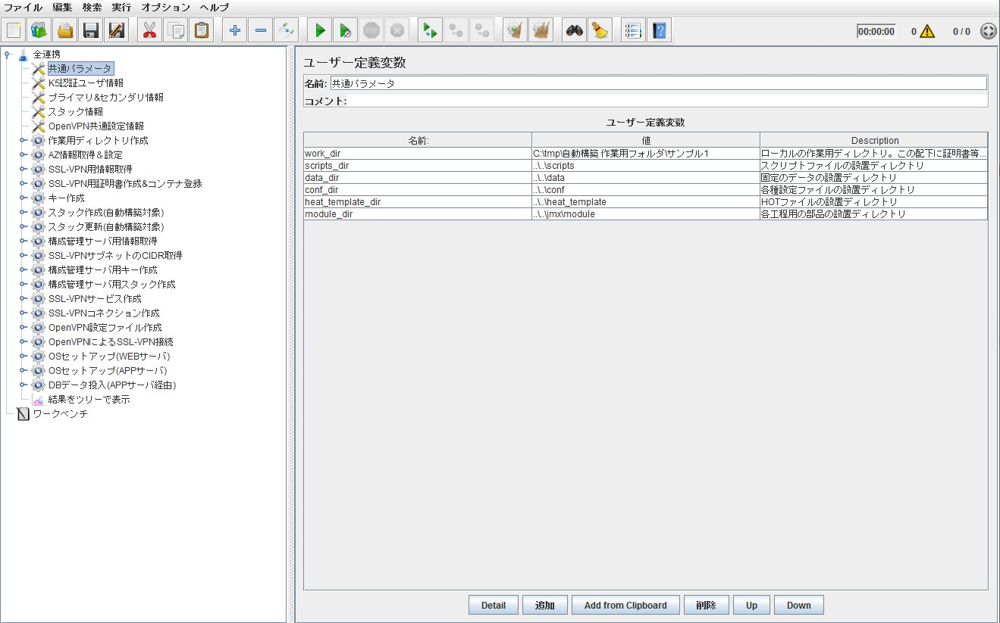
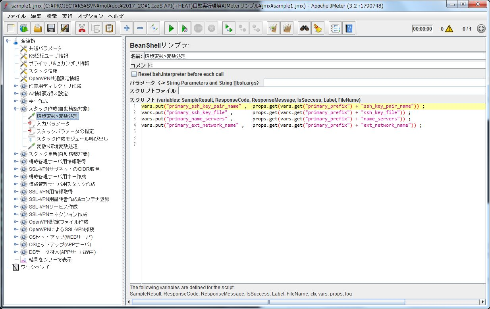
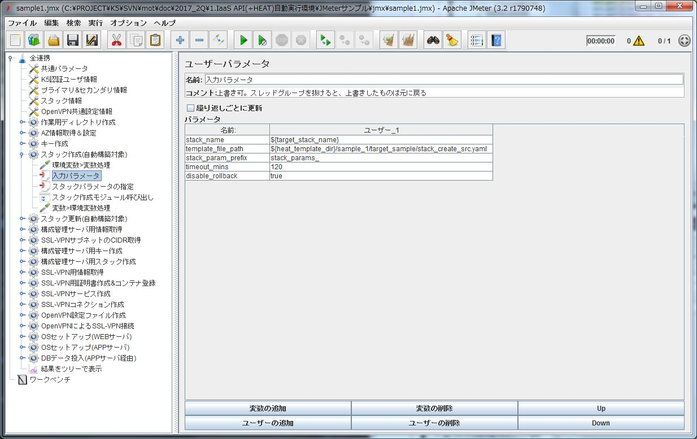
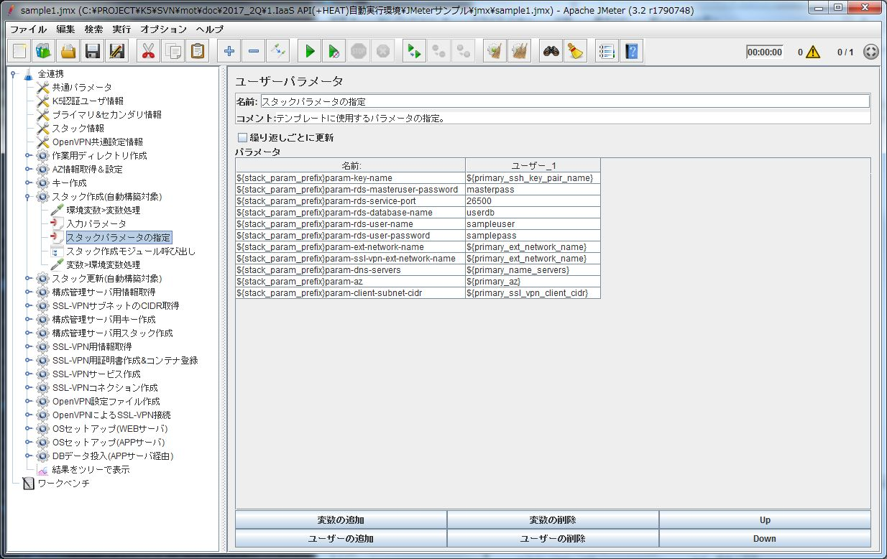
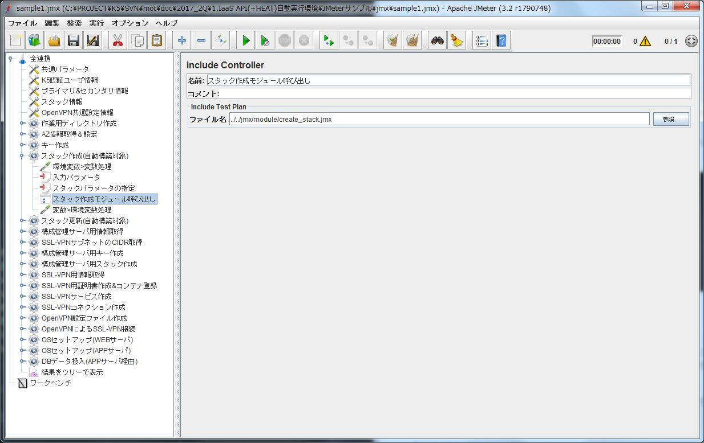
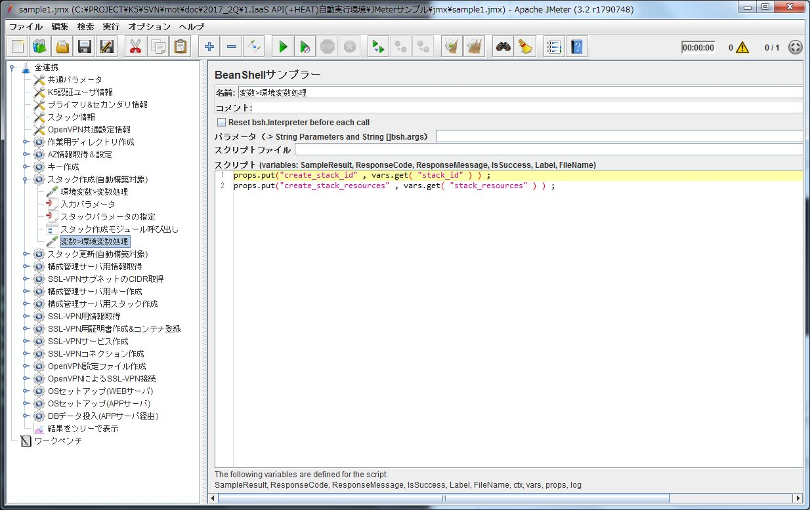
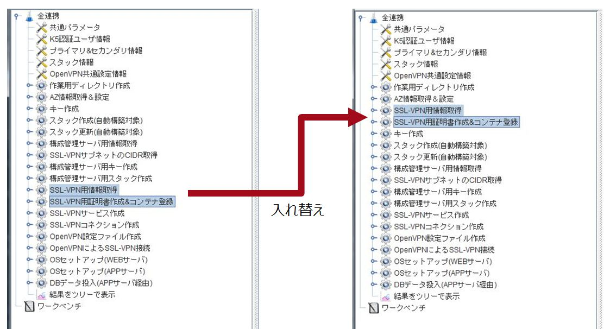
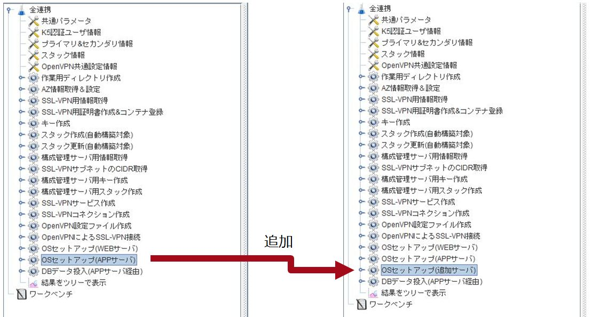

# 各手順の連携

前述したように、自動化を行なうには各手順間での連携が必要になります。
ここでいう連携とは、ある手順でのデータの出力を、別の手順で入力として使用する事を指します。

以下のような例があります。

- 「キーペアの作成(API)」で作成した「ターゲットサーバ用秘密鍵（のパス）」を、「OSのセットアップ(非API)」で使用する
- 「構成管理ツール用スタックの作成(API)」時に、構成管理ツール用サーバを管理用ネットワークに所属させる為に、ターゲットスタックのSSL-VPN用ネットワークIDが必要

自動化では各手順を連携させる為に、連携ツールを構成する必要があります。
以下では、連携ツールの実装についての説明を行います。

## 連携ツールの機能

連携ツールに必要な機能の説明と、実装サンプルについて以下に示します。

### 初期パラメータの入力

- 概要
  いくつかの手順では、他の手順の出力に依らない入力を必要とします。(アカウント情報など)
  そういった入力に対応する為、連携ツールへパラメータを(利用者が)入力する機能が必要になります。
  具体的な実装としては、
  - パラメータを入力したファイルを読み込む(主にCUI)
  - 画面上に入力可能な箇所を用意する(主にGUI)
  等が考えられます。

- 実装時の注意点

  1. パラメータの種類
     初期パラメータには各手順にまたがって使用されるパラメータと、各手順のみで有効なパラメータがあります。
     次のような例があります。
     - 各手順にまたがって使用されるパラメータ
       1. リージョン
       1. ユーザ情報
     - 各手順のみで有効なパラメータ
       1. スタックの作成時のスタックパラメータ
       1. OSセットアップ時に使用するプレイブック
     その為、全体の設定として入力可能な箇所と、各手順の設定として入力可能な箇所を分離する事を推奨します。
     また、ある手順のパラメータが、別の手順のパラメータを上書きしてしまわないようにする必要があります。
  1. 各手順にまたがって使用されるパラメータの参照
    各手順にまたがって使用されるパラメータは各手順において参照出来るように、構成する必要があります。
    例えばリージョンのパラメータがある場合、リージョンの情報は各APIの実行時に必要な事がある為、同じ入力が複数発生しないよう、各手順では入力されたものを参照するように構成されるべきです。

- 実装サンプル

  サンプルではJMeterの「ユーザ定義変数」及び「ユーザパラメータ」を使用します。

  各手順のみで有効なパラメータは「ユーザパラメータ」を使用して入力可能にしています。
  
  「ユーザパラメータ」で設定したパラメータは親のスレッドグループ(この場合は「スタック作成(自動構築対象)」)を抜けると無効になります。

  各手順にまたがって使用されるパラメータは「ユーザ定義変数」を使用して入力可能にしています。
  
  「ユーザ定義変数」で定義されたパラメータは、各スレッドグループが終了しても無効になりません。

  以下では、JMeterのパラメータの特性を利用して、パラメータに別のパラメータの値を利用してます。
  

### 各手順の出力の保持

- 概要

  各手順が返す値を受け取り、別の手順に渡す為に保持しておく機能です。
  具体的な実装としては、
  - 変数への代入
  - ファイルへの書き出し

  等が考えられます。

- 実装時の注意点

  1. 複数の値の出力対応
    １手順で複数の値が出力される可能性があるので(認証等)、１つの手順を複数段階に分けるか、複数の出力を同時に受け取れるようにする等の工夫が必要になります。
  1. 外部プログラムの出力
    外部プログラムの出力は、通常、標準出力(エラー)への出力となる為、それらの出力が必要な場合は、連携ツールの実装方法に影響を与えます。

- 実装サンプル(sample1.jmx)

  JMeterでは値を保持する方法に以下を使用できます。
  - (JMeterの)環境変数：JMeter Properties
  - ユーザ定義変数：JMeter Variables

  この内、ユーザ定義変数については、スレッドグループと呼ばれる単位内でのみ有効であり、スレッドグループ間での利用が出来ません。
  (逆にこの性質を利用して、手順内の変数として使用しています)
  その為、スレッドグループ間での利用が可能なJMeterの環境変数を使用しています。
  基本的に手順と入出力は以下のような構成になっています。

  ```
  手順Ａを実行するスレッドグループ
  |- 環境変数＞変数処理
  |- モジュール呼び出し(手順Ａ)
  |- 変数＞環境変数処理
  手順Ｂを実行するスレッドグループ
  |- 環境変数＞変数処理
  |- モジュール呼び出し(手順Ｂ)
  |- 変数＞環境変数処理
  手順Ｃを．．．
  ```

  「ターゲットスタックの作成」手順では以下のように構成されます。

  1. 環境変数＞変数処理
    JMeterの基本機能(BeanShellサンプラー)を使用して、環境変数から必要な値を取り出し、変数に格納します。
    
    props.get()が環境変数の取り出し。vars.put()が変数への格納です。
  1. 入力パラメータ
    手順の実行に必要なパラメータを設定します。
    各手順の前で設定された変数や「環境変数＞変数処理」で設定した変数を使用する事が出来ます。
    
  1. スタックパラメータの指定
    スタックの作成時に利用されるパラメータを指定します。
    各手順の前で設定された変数や「環境変数＞変数処理」で設定した変数を使用する事が出来ます。
    
  1. スタック作成モジュール呼び出し
     JMeterの基本機能(Include Controller)を使用して、手順の部品(../../jmx/module/create_stack.jmx)を呼び出しています。
    パスはJMeter自身の実行ディレクトリからの相対パスになっています。
    
  1. 変数＞環境変数処理
    JMeterの基本機能(BeanShellサンプラー)を使用して、変数から必要な値を取り出し、環境変数に格納します。
    
    vars.get()が変数の取り出し。props.put()が変数への格納です。

### 手順のコントロール

- 概要

  入出力に依存関係がある事から、各手順の実行順序をコントロールする機能を必要とします。
  例えば
  -「SSL-VPNサービスの作成(API)」

  より前に
  -「SSL-VPN用ルータID取得(API)」
  -「SSL-VPN用サブネットID取得(API)」

  が完了している必要があります(SSL-VPNサービスの作成時に、サブネットIDとルータIDが必要な為)。
  また、目標のシステム構成によって、手順が増減する為、システム構成に合わせて手順を変更出来る必要があります。
  例えば、構築するサーバが１台増えると、最低でもOSのセットアップ(非API)の手順が１つ増えます。

- 実装時の注意点

  誤った手順の削除や実行順序の入れ替えによって、入出力の依存関係に矛盾が発生する可能性があります。
  例えば
  - キーペアの作成前に、ターゲットスタックの作成が構成された為、キーペア名の指定がされていない状態でターゲットスタックの作成が実行される
  - SSL-VPN用情報取得を削除した事により、必要が情報が不足したままSSL-VPNコネクションが作成される。
  等です。
  この回避の為、各手順において入力のチェック機構が必要になります。
  ※IaaSのAPIについては、不正なリクエストは成立しない為、リクエスト内容によってはエラーが発生する為、そちらでチェックを行っても良いです。

- 実装サンプル

  サンプルではJMeterのスレッドグループ単位で各手順を構成するようにしています。
  その為、手順のコントロールは利用者によってスレッドグループ単位で行う事になります。
  以下は手順の入れ替えを行った図になります。
  

  また、以下は手順を追加した場合の図になります。
  

## その他の実装

### エラー処理について

各手順でエラーが発生した場合、その後の処理を停止する事を推奨します。
これは、手順間に依存関係がある為で、前手順のエラー状態の値を後手順に持ち込まない為です。

なお、実装サンプルについては、上記を考慮外としています。

[\[参考情報へ\]](reference.md)
