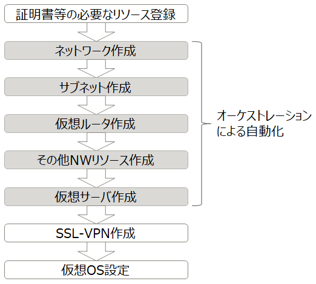
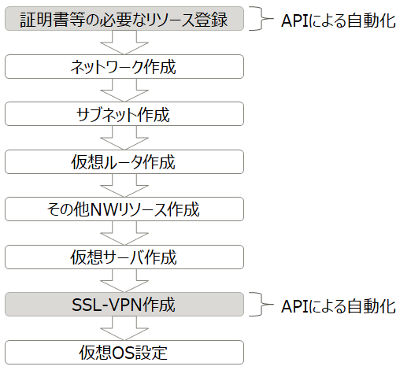
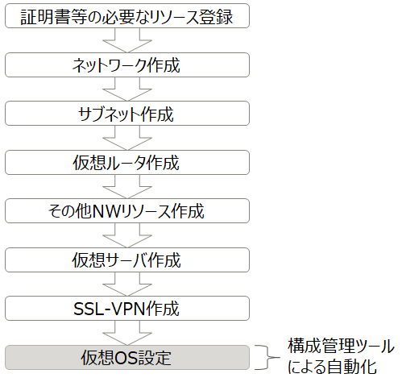
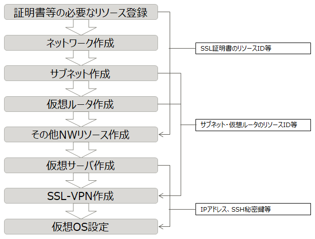

# 自動構築について

ここでは、OSのセットアップを含めた自動構築を行う環境を構築するために考慮するべき事について説明します。

## 1. K5における自動構築サービス(オーケストレーション)の適用範囲

K5ではオーケストレーションサービスを使用したリソースの作成が可能となっています。
ただし、このサービスで作成可能なリソースはK5で作成可能なすべてのリソースに対応しているわけではありません。

対応範囲を図にすると以下のようになります。

例えば、証明書作成やSSL-VPN接続の作成などは、オーケストレーションにより作成できません。

また、DNSやCDNといったグローバルサービスで作成できるリソースに関しても対象外となっています。

オーケストレーションで対応可能なリソースについての詳細はHeatテンプレート解説書を参照して下さい。

## 2. オーケストレーション適用範囲外について

オーケストレーションで対応していないリソースについては、IaaS上のコンピュートやネットワーク等の各機能において、APIが提供されているため、これを利用します。

APIではリソースの取得・作成・更新・削除が操作可能となっています。

以下の図がオーケストレーション以外のAPIで作成可能な箇所になります。

## 3. OSのセットアップについて

APIとオーケストレーションを組み合わせで利用することにより、
IaaSリソースの構築自動化が実現できるようになりました。
一方、仮想OSの設定については上記では対応できません。

厳密には、LinuxおよびWindowsは、Heatテンプレート内でサーバ作成後のコマンドを設定できるため、セットアップを自動化することが不可能ではありません。
しかし、すべてHeatテンプレート内に記述すると複雑になりやすいため、ここでは構成管理ツールを使用することにします。
構成管理ツールには、以下のような利点があります。
- 設定ファイルによる管理の容易さ
- 設定ファイルの再利用性
- (インターネット上で公開された)テンプレートの存在
- スクリプト実行のサポート

以下の図が構成管理ツールでセットアップする箇所になります。

## 4. 各手順の連携実行

ここまでで、インフラの構築とOSのセットアップ、それぞれの自動化について述べました。

しかし、手動構築手順における各手順は前手順の結果に依存している箇所があります。
依存関係の一例を以下の図に示します。

このため、前の手順の結果を拾い上げ、次の手順に反映させることを各手順を連携させるもの（以降、連携ツールとする）が必要になります。

## 5. 連携ツール

連携ツールを実装するに当たって必要となる具体的な技術要素を以下に示します。

### IaaSのAPI(オーケストレーションを含む)で必要な要素

K5 IaaS の API は REST API として提供されているため、連携ツールは以下を満たす必要があります。
- Webでのリクエストができる事
- APIで利用可能なリクエストメソッドに対応している事 (GET, POST, PUT, DELETE...)
- APIのリクエスト&レスポンスボディ方式に対応している事 (JSON, XML)
- レスポンスの一部を抽出し、他の手順で利用できること
- レスポンスの一部を抽出し、ファイルに出力できること (SSH秘密鍵の作成で必要な機能)

連携ツールでAPIを直接呼び出さずに、API実行用の外部プログラムを呼び出す形でも可能です。その場合、外部プログラムと連携ツールとの間で入出力のやり取りができる必要があります。
(外部プログラムへはAPIの実行に必要な情報を渡し、連携ツールはレスポンスを受け取れる必要があります)

### OSのセットアップで必要な要素

連携ツールから構成管理ツールを実行できる必要があります。

IaaSのAPIを利用しているため、Web API が提供されていることが望ましいです。
難しい場合は、連携ツール側でのリクエスト手段と、構成管理ツール側での受付手段の兼ね合いになります。

上記の要素を満たせるように、連携ツール(必要であれば外部プログラムも含めて)を構築する必要があります。

## 6.「自動構築について」のまとめ

自動構築について以下のようにまとめます。

- 自動構築は手動で行なう構築作業を一度で行なうもの。
- K5のオーケストレーションサービスではすべてのリソースを一括で作成する事はできない
- K5のオーケストレーションサービスで対応できないリソースについては各APIで作成する
- OSのセットアップについては、構成管理ツールを使用するほうが良い
- 上記はそれぞれ単独で動作し終了してしまうので、すべての手順を通した自動化には各機能を連携させるもの(連携ツール)が必要
- 連携ツールは各手順の動作に必要な要件を満たしている必要がある

以降は各手順の自動化と連携ツールの構築について述べていきます。

[\[サンプル構成へ\]](sample-system.md)
