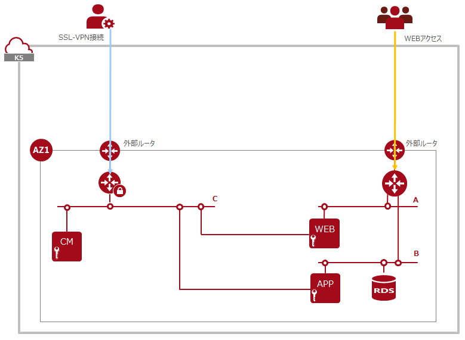

# サンプル構成

ここでは、各工程の自動化及び連携ツールを作成するにあたって留意するべき事項を、具体的な実装例(実装サンプル)と共に示します。

実装サンプルでは、以下のツール類を使用して自動構築を実現しています。

- Apache JMeter(以下の追加ライブラリ含む)
  - [JSONObjectとJSONArrayを使用する為のライブラリ](http://central.maven.org/maven2/org/json/json/20160212/json-20160212.jar)
  - [プラグインマネージャー](https://jmeter-plugins.org/get/)
  - [SSHサンプラーを追加するライブラリ](https://jmeter-plugins.org/files/packages/ssh-sampler-1.1.1-SNAPSHOT.zip)
  - [SSHに必要なライブラリ](http://sourceforge.net/projects/jsch/files/jsch.jar/0.1.54/jsch-0.1.54.jar/download)
- Ansible
- OpenSSL
- OpenVPN

役割はそれぞれ以下の通りです。
- 連携：Apache JMeter
- インフラの構築：(以下に細分化)
  - IaaSのAPI実行：Apache JMeter
  - 証明書作成：OpenSSL
- OSのセットアップ：
  - 構成管理ツールへの接続：OpenVPN
  - 構成管理ツール：Ansible

各ツールの使用方法については、公式ドキュメントを参照してください。

なお、使用する実装サンプルの内容全部を説明するわけではありませんが、ご了承ください。

実装において具体的な説明を行う際の「自動的に構築されるシステム構成」の例を以下に示します (以下「目標サンプル構成」と言います)。

一般的な（冗長化されていない）Web 3階層アーキテクチャーに、管理ネットワークと構成管理サーバを加えたものになります。
管理ネットワークはSSL-VPN接続からのみアクセスできます。
Webアクセスは、仮想ルータからWebサーバにルーティングされ、Webサーバの設定により、Appサーバのアプリケーションに接続されます。
Appサーバは、内部ネットワークにあるDBサーバに対してデータの作成・参照・更新・削除を行います。

## 目標サンプル構成構築の流れ
目標サンプル構成を手動構築する場合の詳細な手順は以下の通りです。
(API)はIaaSのAPIで実行する手順です。
(非API)はIaaSのAPI以外で実行する手順です。

**IaaS利用準備**
- 認証(API)

**スタック(共通)の作成に必要な情報の取得**
- 外部ネットワーク名取得(API)
- 外部ネットワークID取得(API)
- DNSサーバリスト取得(非API)

**ターゲットスタック作成に必要なリソースの作成・登録**
- キーペアの作成(API)

**ターゲットスタックの作成**
- ターゲットスタックの作成(API)
- ターゲットスタックの更新(API)

**構成管理ツール用スタックの作成に必要な情報の取得**
- SSL-VPN用ネットワークID取得(API)
- SSL-VPN用サブネットID取得(API)
- SSL-VPN用サブネットCIDR取得(API)

**構成管理ツール用スタックに必要なリソースの作成・登録**
- 構成管理ツール用キーペアの作成(API)

**構成管理ツール用スタックの作成**
- 構成管理ツール用スタックの作成(API)

**SSL-VPNの利用に必要な情報の取得**
- SSL-VPN用ルータID取得(API)
- SSL-VPN用ルータポートID取得(API)
- SSL-VPN用ルータポートIP取得(API)

**SSL-VPNの利用に必要なリソースの作成・登録**
- SSL-VPN用鍵情報の作成(非API)
- SSL-VPN用鍵情報の登録(API)
- SSL-VPN用鍵コンテナの作成(API)

**SSL-VPN接続の作成**
- SSL-VPNサービスの作成(API)
- SSL-VPNコネクションの作成(API)

**SSL-VPN接続の利用**
- SSL-VPN接続用設定ファイル作成(非API)
- SSL-VPN接続(非API)
- SSL-VPN接続確認(非API)

**OSセットアップ**
- 構成管理ツール用サーバID取得(API)
- 構成管理ツール用サーバIP取得(API)
- WEBサーバSSL-VPN側ポートID取得(API)
- WEBサーバSSL-VPN側ポートIP取得(API)
- APPサーバサービス側サブネットID取得(API)
- APPサーバサービス側ポートID取得(API)
- APPサーバサービス側ポートIP取得(API)
- WEBサーバのセットアップ(非API)
- APPサーバSSL-VPN側ポートID取得(API)
- APPサーバSSL-VPN側ポートIP取得(API)
- DBサーバID取得(API)
- DBサーバIP取得(API)
- APPサーバのセットアップ(非API)

**DBデータ投入**
- DBサーバへのデータ投入(非API)※APPサーバ経由

以下、各手順の実装方法について説明していきます。
