# サンプル利用ガイド

## 本ガイドの目的

本ガイドは、IaaS システム構築自動化ガイドに記載されている
内容を実施するためのサンプルツールの利用方法を説明します。

## 前提

本ガイドの利用にあたっては以下の知識を有している事を前提としています。

- FUJITSU Cloud Service K5 IaaSに関する基本的な知識
- Heatテンプレートに関する基本的な知識
- Ansibleに関する基本的な知識

また、サンプルの利用にあたってはK5上のアカウントが以下のロールを有している必要があります。

- 設計・構築者ロール (cpf\_systemowner)

## 注意事項

### サンプルの使用について

本ガイドで使用しているツール及びサンプルファイルは自己責任での利用をお願いいたします。
また、使用しているツールの利用については、各ツールの利用規約に同意した上でご使用下さい。

### リソースの削除について

作成された環境（リソース）の削除はサンプルでは対応していません。
K5の公式ドキュメントを参照して手動での削除をお願い致します。

### 操作画面について

サンプルはLinux上で動作することを確認していますが、
本ガイドでは基本的にWindowsでの操作を記述します。

### JMeterについて

本ガイドで案内するサンプルでは、システム構築を行なうツールとしてJMeterを使用しています。
JMeterは負荷テストで使用するツールであり、本来の使用方法と異なっている事を予めお断りします。

## 参考資料

- FUJITSU Cloud Service K5 IaaS 機能説明書
- FUJITSU Cloud Service K5 IaaS API リファレンス
- FUJITSU Cloud Service K5 IaaS Heat テンプレート解説書
- FUJITSU Cloud Service K5 IaaS API ユーザーズガイド

## 環境構築

### サンプルのダウンロード

2種類のサンプルを用意しています。

- [サンプル1](sample1.zip)
- [サンプル2](sample2.zip)

本ガイドでは、サンプル1を使用して説明していきますが、
サンプル2でも同様の手順で構築できます。
サンプルをダウンロードして、任意の場所に設置します。
本ガイドでは、次のディレクトリ（以下「サンプルディレクトリ」と言う）
に保存したこととして説明していきます。

> C:\tmp\サンプル1

### サンプル構成

#### サンプル1

サンプルで作成されるインフラ構成の概要図を以下に示します。

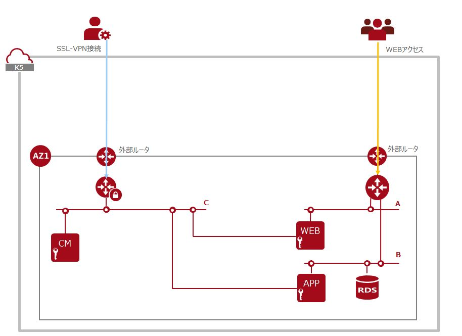

- 一般的な(冗長化がされていない)WEB３層アーキテクチャに、管理ネットワークと構成管理サーバを加えたものになります。
- 管理ネットワークはSSL-VPN接続でのみアクセスが可能となっています。
- WEBアクセスは仮想ルータからWEBサーバへルーティングされ、WEBサーバの設定により、APPサーバ上のアプリケーションへの接続が行われます。
- APPサーバは同ネットワークにあるDBサーバ(RDS)に対してデータの作成・参照・更新・削除を行います。

サンプルで作成されるK5上のリソースは、大きく分けると以下で作成されます。

- ターゲットスタックの作成・更新
- 構成管理ツール用スタックの作成
- その他

以下の図は、それぞれの範囲を示しています。
※全てのリソースを示しているわけではありません。

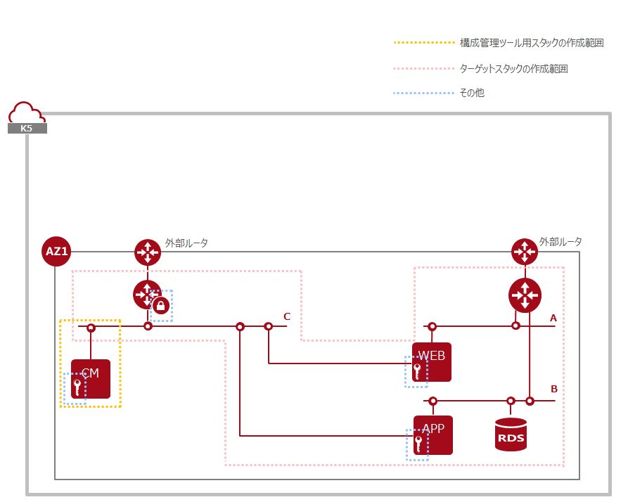

#### サンプル2

サンプル2で作成されるインフラ構成の概要図を以下に示します。

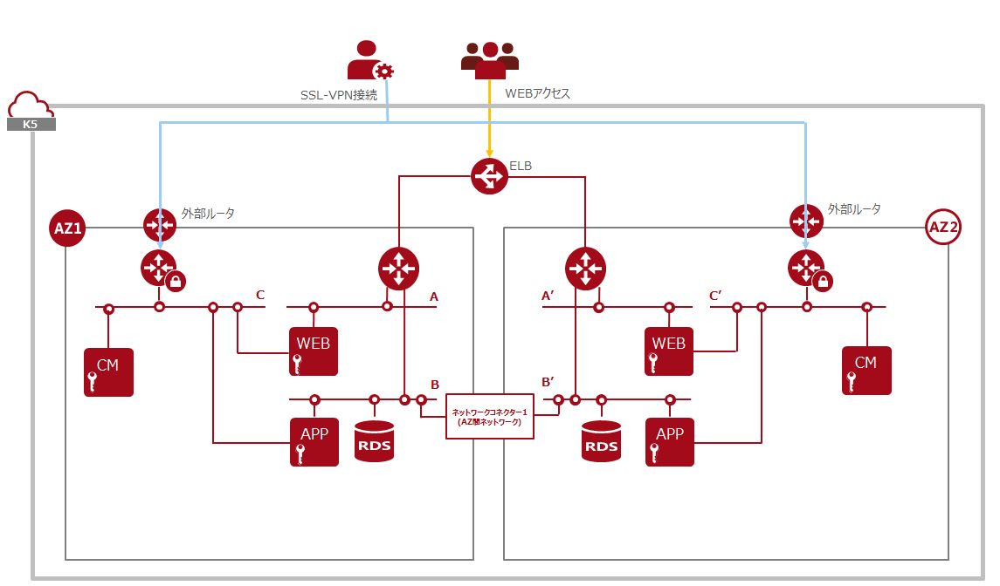

- 冗長化されたWEB３層アーキテクチャに、管理ネットワークと構成管理サーバを加えたものになります。
- サンプル1との相違点は各構成要素がAZに跨って冗長化されている点になります。
- WEBアクセスはELBにて受付が行われ、両方のAZのWEBサーバへ負荷分散されます。
- WEBサーバは同一AZのAPPサーバへアクセスを行います。
- APPサーバはDBサーバ(RDS)のFQDNに対してデータの作成・参照・更新・削除を行います。
- DBサーバは冗長化されており、DBサーバのFQDNはいずれか優先度の高い(プライマリの)インスタンスIPを示します。
- APPサーバが自AZにはないDBサーバへアクセスする際はネットワークコネクターを経由して行われます。

サンプル2においてもK5上のリソースは、大きく分けると以下で作成されます。

- ターゲットスタックの作成・更新
- 構成管理ツール用スタックの作成
- その他

以下の図は、サンプル2におけるそれぞれの範囲を示しています。
※全てのリソースを示しているわけではありません。

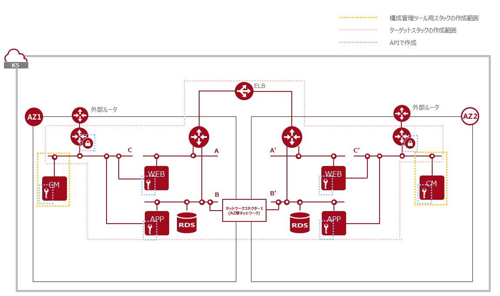

### サンプルの構成

サンプルのディレクトリ構成は以下のようになっています。

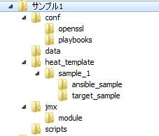

各ディレクトリの役割は以下になります。

- openssl       ： OpenSSLを使用して鍵情報を作成する際の設定ファイルが存在
- playbooks     ： OSをセットアップする際に利用するプレイブック※が存在
- data          ： 共通ネットワークサービスのJSONファイルが存在するディレクトリ
- ansible\_sample： 構成管理ツール用スタックを作成するHeatテンプレートが存在するディレクトリ
- target\_sample ： ターゲットスタックを作成・更新するHeatテンプレートが存在するディレクトリ
- jmx           ： JMeterのテスト計画ファイル(jmx)が存在するディレクトリ
- jmx/module    ： 他のjmxファイルから読み込まれるjmxが存在するディレクトリ
- scripts       ： JMeterで利用するスクリプトファイルが存在するディレクトリ

※ 構成管理ツールである、Ansibleにて利用されるファイルになります。詳細については、Ansibleの公式ドキュメントを参照して下さい。

### 各種ソフトウェアの準備

ここでは、サンプルの実行に必要な各種ソフトウェアの準備を行います。

#### Apache JMeter

Apache JMeterは、パフォーマンス測定および負荷テストを行うJavaアプリケーションです。
サンプルでは、一般的なJMeterの使い方とは少し異なりますが、JMeterの多機能性を利用して、K5上にシステムを構築するために利用します。

動作確認済みのバージョンは3.2になります。

ダウンロードは[公式サイト](http://jmeter.apache.org/)にて行ってください。
ダウンロード後、サンプルの解凍先と同じフォルダに解凍します。
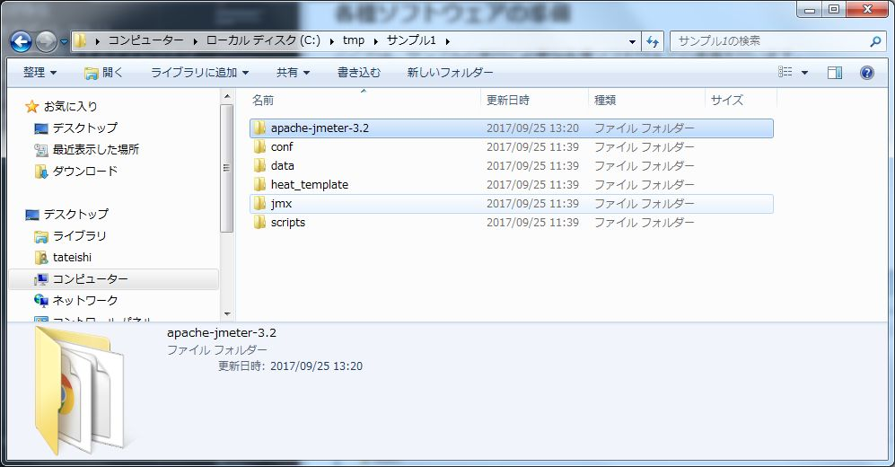

#### Apache JMeterの追加ライブラリ

サンプルファイルの動作に必要な追加のライブラリを用意します。

1. JSON操作用ライブラリ
   [mavenリポジトリ](http://central.maven.org/maven2/org/json/json/20160810/json-20160810.jar)よりダウンロードします。
   動作確認済みのバージョンは20160810になります。
   ダウンロードしたjarファイルを、JMeterのlibのディレクトリに設置します。
   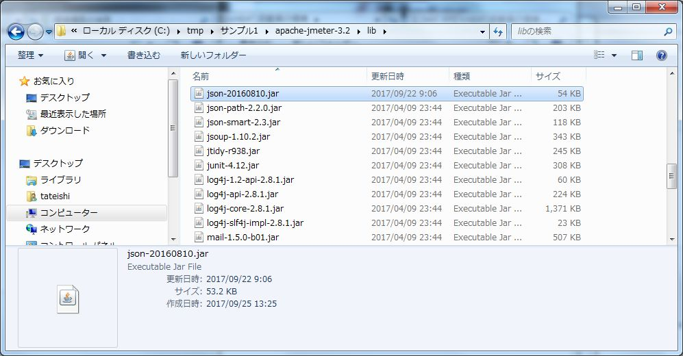

1. SSHサンプラー
   [GitHub](https://github.com/yciabaud/jmeter-ssh-sampler/releases/download/jmeter-ssh-sampler-1.1.1/ApacheJMeter_ssh-1.1.1.jar)よりダウンロードします。
   動作確認済みのバージョンは1.1.1なります。
   ダウンロードしたjarファイルを、JMeterのlib/extのディレクトリに設置します。
   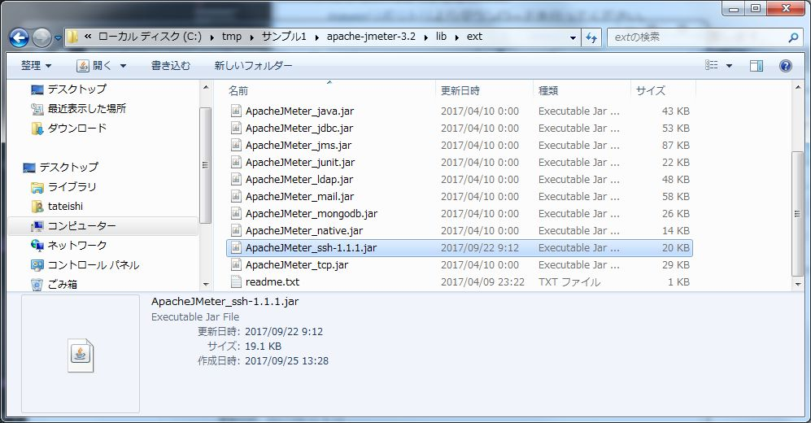

1. SSHライブラリ
   [GitHub](https://github.com/yciabaud/jmeter-ssh-sampler/releases/download/jmeter-ssh-sampler-1.1.1/jsch-0.1.54.jar)よりダウンロードします。
   動作確認済みのバージョンは0.1.54になります。
   ダウンロードしたjarファイルを、JMeterのlibのディレクトリに設置します。
   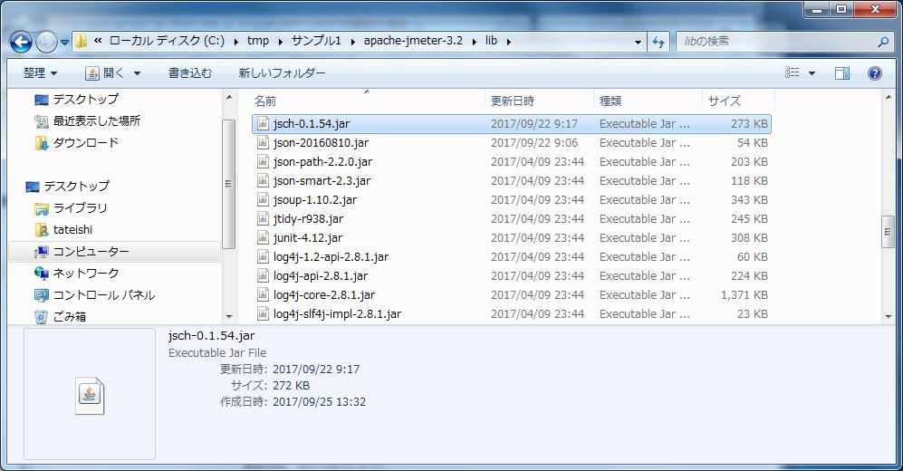

#### Java

JMeterの動作の為、Javaの実行環境を用意します。
使用するJMeterはJava 8を必要とする為、JDKをダウンロードしてインストールを行って下さい。
インストール後、以下のコマンドを実行しインストール出来ている事を確認します。

```
$ java -version
```

以下のように表示されれば問題ありません。
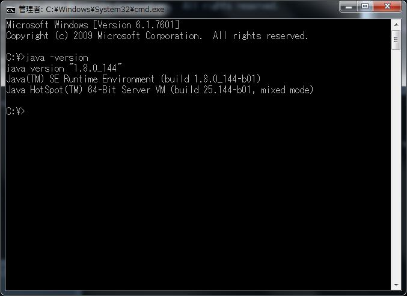

#### OpneSSL(自己署名を利用する場合)

鍵の作成に使用する為、OpenSSLをインストールします。
コンパイル済みのものを
[こちらから](http://slproweb.com/products/Win32OpenSSL.html)
ダウンロードしてインストールして下さい。
この際、できるだけ最新のものを使用するようにして下さい。

インストール後、以下のコマンドを実行しインストール出来ている事を確認します。

```
$ openssl version
```

以下のように表示されれば問題ありません。

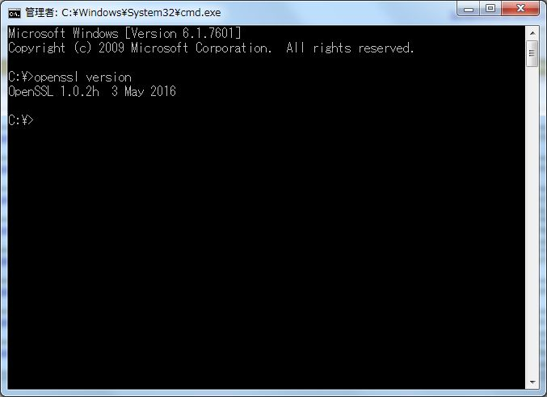

#### OpenVPN

VPN接続に使用する為、OpneVPNをインストールします。
[公式サイト](https://openvpn.net/index.php/open-source/downloads.html)
からダウンロードしてインストールして下さい。
インストールするバージョンについては、ユーザガイドを参照して下さい。

インストール後、以下のコマンドを実行しインストール出来ている事を確認します。

```
$ openvpn --version
```

以下のように表示されれば問題ありません。

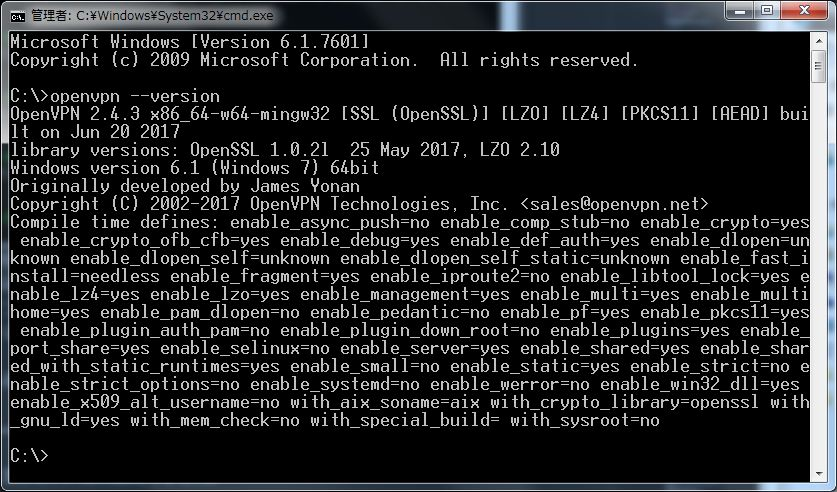

## サンプル実行

### サンプル概要

#### 作成されるリソースについて

サンプルで作成される具体的なリソースは以下のようになります。

- SSL-VPNネットワーク関連
  - SSL-VPNネットワーク用ルータ
  - SSL-VPNネットワーク用ルータインターフェース
  - SSL-VPNネットワーク用ルータポート
  - SSL-VPNネットワーク
  - SSL-VPNサブネットワーク
  - SSL-VPN接続用セキュリティグループ
  - SSL-VPNサービス
  - SSL-VPNコネクション
  - SSL-VPN用サーバ証明書
  - SSL-VPN用サーバ秘密鍵
  - SSL-VPN用独自CA証明書
  - SSL-VPN用DH鍵
  - SSL-VPN用鍵コンテナ

- 外部接続関連
  - 外部接続用ルータ

- WEBサーバネットワーク関連
  - WEBサーバネットワーク
  - WEBサーバサブネットワーク
  - 外部接続用ルータのWEBサーバネットワーク用インターフェース
  - 外部接続用ルータのWEBサーバネットワーク用インターフェースポート

- APP&RDSサーバネットワーク関連
  - APP&RDSサーバネットワーク
  - APP&RDSサーバサブネットワーク
  - 外部接続用ルータのAPP&RDSサーバネットワーク用インターフェース
  - 外部接続用ルータのAPP&RDSサーバネットワーク用インターフェースポート

- WEB&APPサーバ共通
  - アクセス用公開鍵

- WEBサーバ関連
  - WEBサーバ
  - WEBサーバ用ボリューム
  - WEBサーバ用WEBサーバネットワーク側ポート
  - WEBサーバ用SSL-VPNネットワーク側ポート
  - WEBサーバ用FIP
  - WEBサーバ用セキュリティグループ

- APPサーバ関連
  - APPサーバ
  - APPサーバ用ボリューム
  - APPサーバ用WEBサーバネットワーク側ポート
  - APPサーバ用SSL-VPNネットワーク側ポート
  - APPサーバ用セキュリティグループ

- RDSサーバ関連
  - RDSサーバ
  - RDSサーバ用サブネットグループ
  - RDSサーバ用セキュリティグループ

- CM(構成管理ツール用)サーバ関連
  - CMサーバ用ボリューム
  - CMサーバ用SSL-VPNネットワーク側ポート
  - CMサーバ用セキュリティグループ
  - アクセス用公開鍵

また、以下に関しては実行したマシンに保存されます。

- SSL-VPNネットワーク関連
  - SSL-VPN用DHクライアント証明書
  - SSL-VPN用DHクライアント秘密鍵
  - SSL-VPN用サーバ証明書
  - SSL-VPN用サーバ秘密鍵
  - SSL-VPN用独自CA証明書
  - SSL-VPN用DH鍵

- WEB&APPサーバ共通
  - アクセス用公開鍵

- CM(構成管理ツール用)サーバ関連
  - アクセス用秘密鍵

#### サーバのセットアップについて

各サーバはCMサーバによってセットアップが行われます。
CMサーバはJMeterによって操作されます。

WEBサーバのセットアップは、以下のような流れになります。

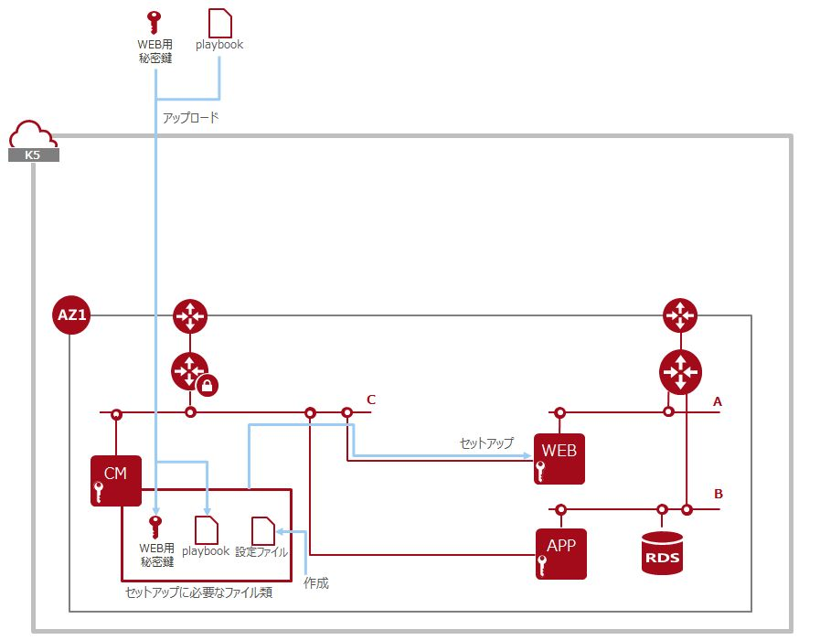

1. JMeterからSFTPを使用して、必要なファイル(playbook及びアクセス用の秘密鍵)がCMサーバへアップロードされます。
1. JMeterからSSHを使用して、WEBサーバのセットアップ用の設定ファイルがCMサーバ上に作成されます。
1. JMeterからSSHを使用して、セットアップコマンドが実行されます。この時、作成及びアップロードしたファイルが使用されます。

以下は各サーバのセットアップ内容になります。

- WEBサーバのセットアップ
  - httpd(apache)のインストール
  - httpdのAPPサーバに対するリバースプロキシ設定
  - httpdの起動

- APPサーバのセットアップ
  - node.js及びnode.jsの動作に必要なパッケージのインストール
  - postgresqlのインストール(RDS接続用)
  - サンプルアプリケーションの展開
  - サンプルアプリケーションのDB接続情報設定
  - サンプルアプリケーションの起動

- RDSのセットアップ(APPサーバを経由※)
  - サンプルデータの投入

※RDSはCMサーバから直接アクセスする事が出来ない為、
APPサーバに対して「RDSへサンプルデータの投入を行なうplaybook」を実行して行います。

### 実行手順

以下ではサンプルの実行手順を示します。

1. JMeterの起動
  サンプルディレクトリに展開したJMeterの起動スクリプトを実行します。
  ※プロキシ環境で実行する場合は「付録＞プロキシについて」を参照して下さい。

1. sample1.jmxの読み込み
  「ファイル＞開く」を選択し、読み込み画面を表示します。

  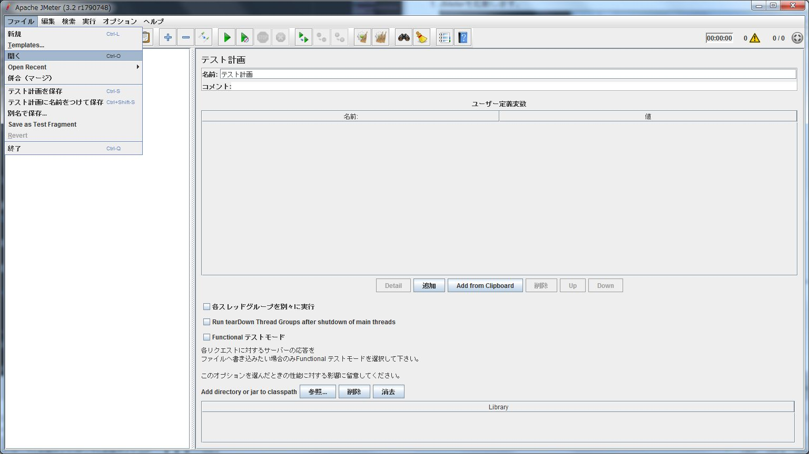

  サンプルディレクトリの「jmx/sample1.jmx」を選択し、開きます。

  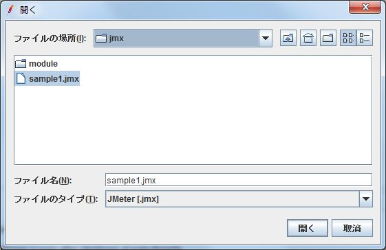

1. 共通パラメータ入力
  共通パラメータを入力していきます。

  共通パラメータは、サンプル上で常に参照(及び更新)可能な変数として保持されます。
  常に参照可能というのは「作業用ディレクトリ作成」や「AZ情報取得＆設定」内であっても参照可能という事です。

  入力する箇所は以下になります。

  

  以下、各設定の情報になります。

  - ディレクトリ情報
    ディレクトリ情報を入力する場所になります。

    - work\_dir：実行結果や、鍵ファイルを作成するディレクトリを指定します。任意のディレクトリを指定して下さい。
    - scripts\_dir： サンプルディレクトリの「scripts」が存在するディレクトリを指定します。修正する必要はありません。
    - data\_dir：サンプルディレクトリの「data」が存在するディレクトリを指定します。同じく修正する必要はありません。
    - heat\_template\_dir：サンプルディレクトリの「heat\_template」が存在するディレクトリを指定します。同じく修正する必要はありません。
    - module\_dir：サンプルディレクトリの「jmx/module」が存在するディレクトリを指定します。同じく修正する必要はありません。

  - K5認証ユーザ情報
    K5の認証に必要な情報を入力する場所になります。

    - K5\_CONTRACT：契約番号を指定します。
    - K5\_USER：ユーザ(アカウント)名を指定します。指定されるユーザはプロジェクトに対して設計・構築者ロール(cpf\_systemowner)を所有している必要があります。
    - K5\_PASS：パスワードを指定します。
    - K5\_PROJECT：対象のプロジェクトを指定します。
    - K5\_REGION：対象のリージョンを指定します。

  - プライマリ&セカンダリ情報
    AZ(アベイラビリティゾーン)毎の設定を指定する場所になります。

    - primary\_az：サンプル構成を作成するAZを指定します。必要に応じて修正して下さい。
    - primary\_prefix：AZの識別に使用するプレフィックスになります。基本的に修正する必要はありません。
    - primary\_ssl\_vpn\_client\_cidr：SSL-VPN接続の際に使用されるネットワークのCIDRになります。サンプルを実行するマシンがアクセスする可能性があるCIDRを指定しないで下さい。

  - スタック情報
    作成するスタック名の情報を入力します。

    - target\_stack\_name：ターゲットスタックの名前を指定します。
    - cm\_stack\_name：構成管理ツール用スタックの名前を指定します。

  - OpenVPN共通設定情報
    SSL-VPN接続に必要な情報を入力します。

    - proxy\_option：接続にプロキシを使用する場合はtrueを指定します。
    - proxy\_auth\_option：プロキシ接続に認証が必要な場合はtrueを指定します。
    - auth\_mode：プロキシの認証モードです。basicのみが入力可能です。
    - proxy\_auth\_info\_file\_name：認証情報(ユーザ名&パスワード)が出力されるファイルを指定します。
    - username：プロキシのユーザ名を指定します。
    - password：プロキシのパスワードを指定します。
    - proxy\_address：プロキシのアドレスを指定します。
    - proxy\_port：プロキシのポートを指定します。
    - remote\_port：SSL-VPN接続先のポートを指定します。K5では443で固定になります。
    - cipher：暗号化セットを指定します。修正する必要はありません。
    - log\_file\_name：OpenVPN実行時にログを出力するファイル名を指定します。

  - その他の共通パラメータ
    SSL-VPN接続に必要な情報を入力します。

    - db\_masterpass：RDSを作成する際のマスターパスワードを指定します。変更を推奨します。
    - db\_port：RDSの受付ポートを指定します。
    - db\_name：RDS内に作成されるデータベース名を指定します。変更を推奨します。
    - db\_user\_name：RDSに作成されるユーザ名を指定します。ユーザはデータベースのオーナーになります。変更を推奨します。
    - db\_user\_pass：RDSに作成されるユーザのパスワードを指定します。変更を推奨します。

1. 各工程パラメータ入力

  各工程とは「作業用ディレクトリ作成」や「AZ情報取得＆設定」等のJMeter上でスレッドグループと呼ばれる単位の事を指しています。

  各工程のパラメータは、スレッドグループ内に定義されたユーザパラメータにて設定します。

  ユーザパラメータの例を以下に示します。

  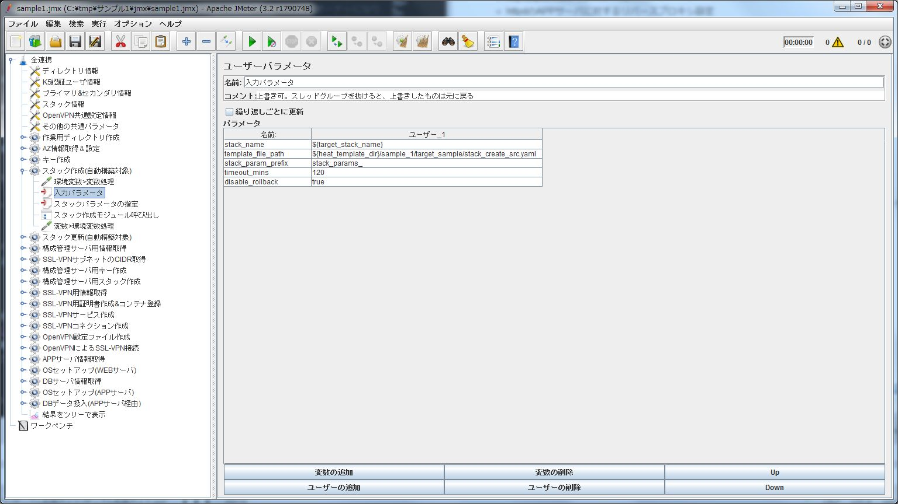

  各工程において入力可能なパラメータは多岐に渡るため、ここでは修正が必要あるいは推奨される箇所のみ示します。

  - SSL-VPN用証明書作成&コンテナ登録＞プライベートCA証明書登録＞入力パラメータ
    作成されたプライベートCA証明書をK5に登録する際に必要なパラメータになります。
    修正が必要な項目は以下になります。

    - expiration：K5上の有効期限を指定します。

  - SSL-VPN用証明書作成&コンテナ登録＞DH鍵登録＞入力パラメータ
    作成されたプライベートCA証明書をK5に登録する際に必要なパラメータになります。
    修正が必要な項目は以下になります。

    - expiration：K5上の有効期限を指定します。

  - SSL-VPN用証明書作成&コンテナ登録＞サーバー証明書登録＞入力パラメータ
    作成されたサーバ証明書をK5に登録する際に必要なパラメータになります。
    修正が必要な項目は以下になります。

    - expiration：K5上の有効期限を指定します。

  - SSL-VPN用証明書作成&コンテナ登録＞サーバー秘密鍵登録＞入力パラメータ
    作成されたサーバ秘密鍵をK5に登録する際に必要なパラメータになります。
    修正が必要な項目は以下になります。

    - expiration：K5上の有効期限を指定します。

1. 実行指示
   JMeterの上部にある開始ボタンをクリックして実行します。

   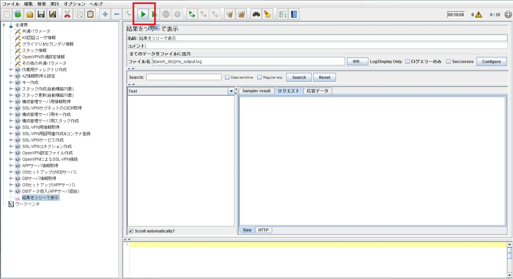

   完了まで待機します。
   実行中の様子は「結果をツリーで表示」を選択する事で確認できます。

   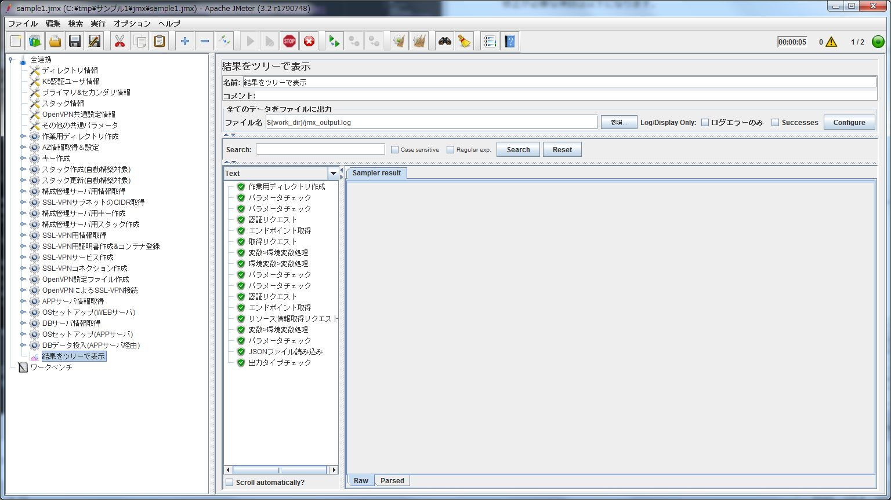

   再度押せるようになっていたら終了しています。

   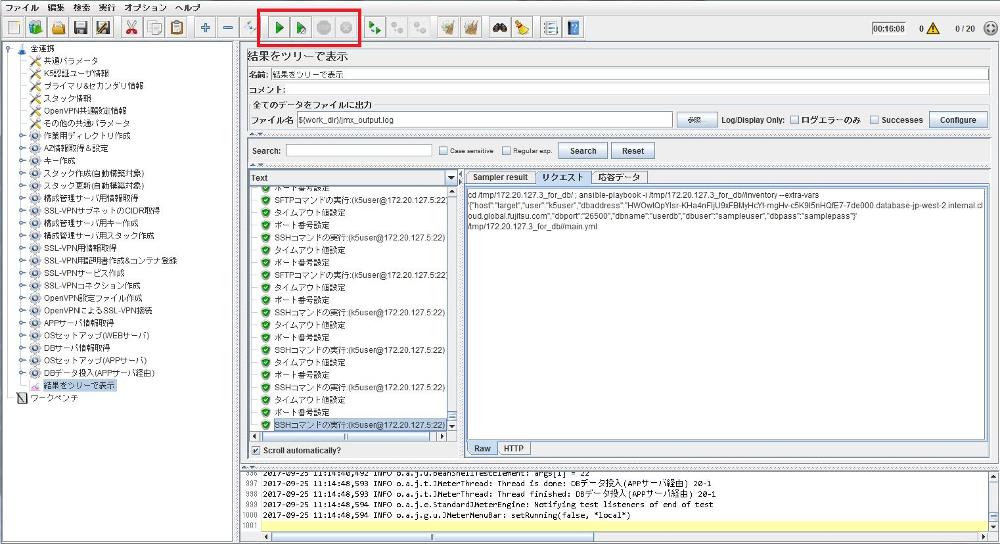

1. 結果の確認
   「結果をツリーで表示」を選択し、エラーで終了していない事を確認します。

   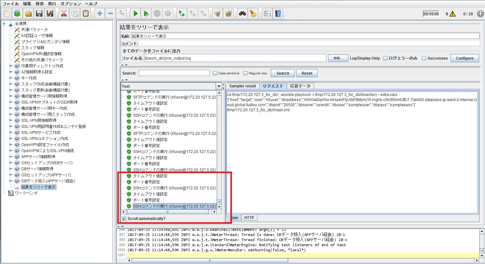

   IaaSポータルにアクセスし以下の手順でグローバルIPアドレスを確認します。

   - コンピュート＞仮想サーバを選択
   - 「sample-pri-web-server」を選択
   - ポート欄にある「sample-pri-web-port」のグローバルIPを確認

   ブラウザで以下にアクセスし、サンプルページが表示される事を確認します。

   > http://{確認したグローバルIP}/app/text.html

   以下のような画面が表示されれば、セットアップは正常に完了しています。

   

   なお、以下は認証に失敗した場合の図になります。

   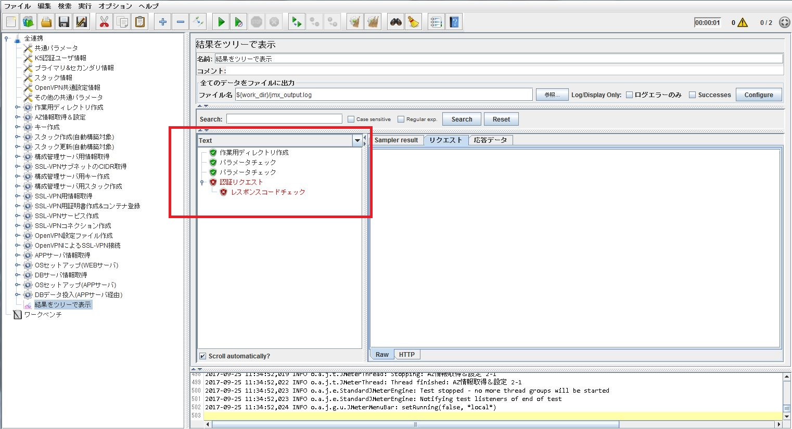

1. VPN接続の停止
   サンプルの処理の途中で、OpenVPNを使用してSSL-VPN接続を行った為、OpenVPNのプロセス(openvpn.exe)が起動した状態となっています。
   SSL-VPN接続が不要な場合はこのプロセスをタスクマネージャー等で停止する必要があります。

## カスタマイズ例

ここではサンプルに対して、設定をカスタマイズするいくつかの例を示します。

### ターゲットスタック作成時のパラメータの変更

ターゲットスタックの作成の際に、パラメータを変更したい場合は
「スタック作成(自動構築対象)＞スタックパラメータの指定」の内容を変更します。

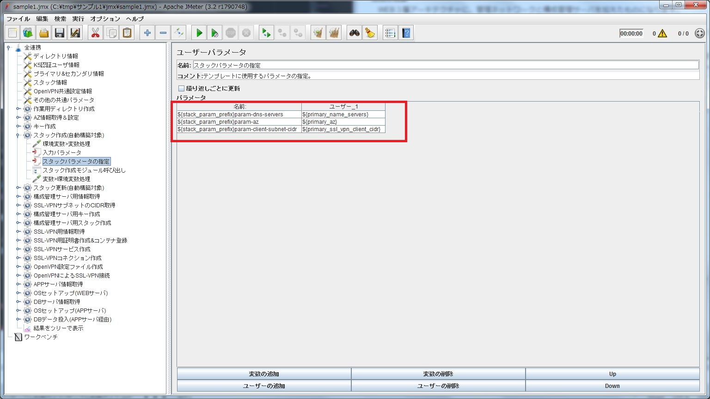

**各スタックパラメータの行頭に「${stack\_param\_prefix}」を指定する必要があります。
これは「module/create\_stack.jmx」内でスタックパラメータと通常のパラメータの区別に使用している為になります。
この指定がない場合は、スタックパラメータとみなされませんので注意して下さい。**

### ターゲットスタックのHeatテンプレートの変更

ターゲットスタックの作成の際に、サンプルとはHeatテンプレートを使用したい場合は、
「スタック作成(自動構築対象)＞入力パラメータ」の「template\_file\_path」を変更します。

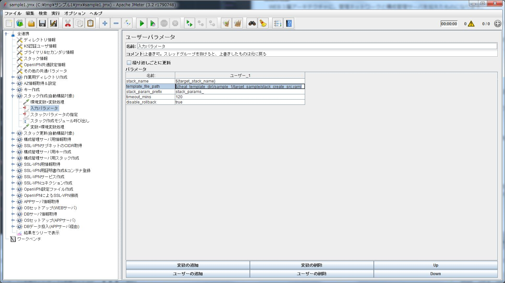

※更新も同様です。

Heatテンプレートを変更した場合は、内容に応じて以下の変更が必要になります。

- スタックパラメータの修正
  スタック作成時のパラメータの指定をHeatテンプレートに適合したものにする必要があります。
  修正箇所は「スタック作成(自動構築対象)＞スタックパラメータの指定」になります。
  

- スタックから情報取得箇所の修正
  スタックからリソース情報を取得する箇所において、リソース名等の修正を行なう必要があります。
  例えば、新しいのHeatテンプレートにおいてSSL-VPNルータのポートのリソース名が「new\_ssl\_vpn\_router」となっていた場合、「SSL-VPN用情報取得＞ルータID＞入力パラメータ」の「resource\_name」を変更します。
  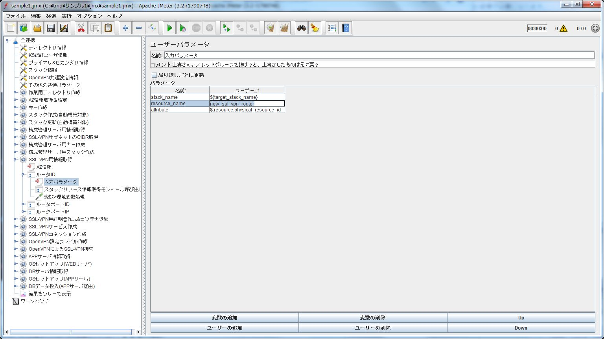

### スタックからのリソースID取得

作成(更新)したスタックから、リソースIDを取得し、工程間で利用したい場合は以下のようにスレッドグループを構成します。

- 入力パラメータの設定
  以下のパラメータを設定します。

  - stack\_name：対象のスタック名を指定
  - resource\_name：リソースIDを取得したいHeatテンプレート上のリソース名を指定
  - attribute：「$.resource.physical\_resource\_id」で固定

  以下は、「WEBサブネットのリソースID」を取得する場合の入力パラメータの設定になります。
  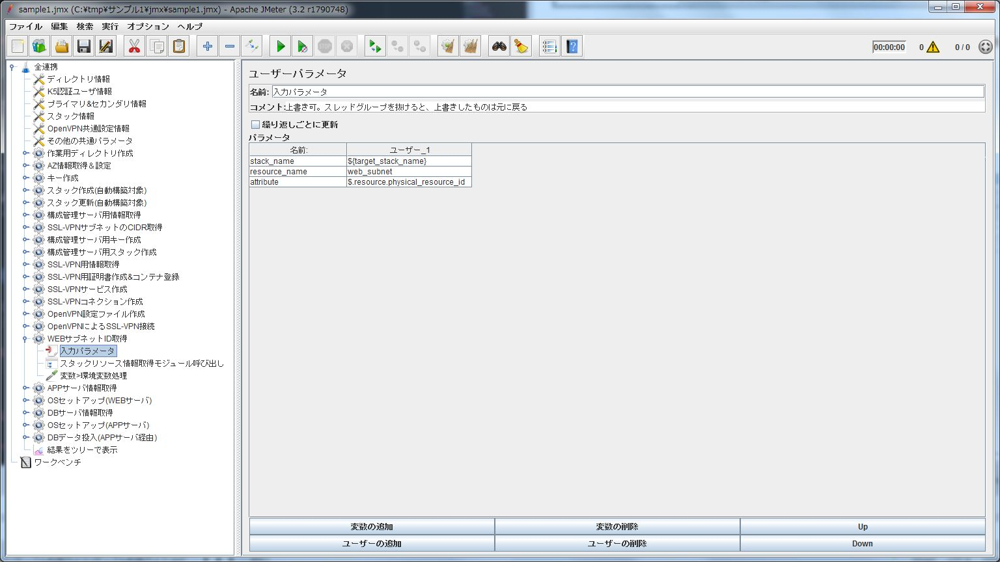


- 部品の読み込み
  JMeterの「Incluede Controller」機能を使用して「module/get\_stack\_resouce\_info.jmx」を読み込みます。

  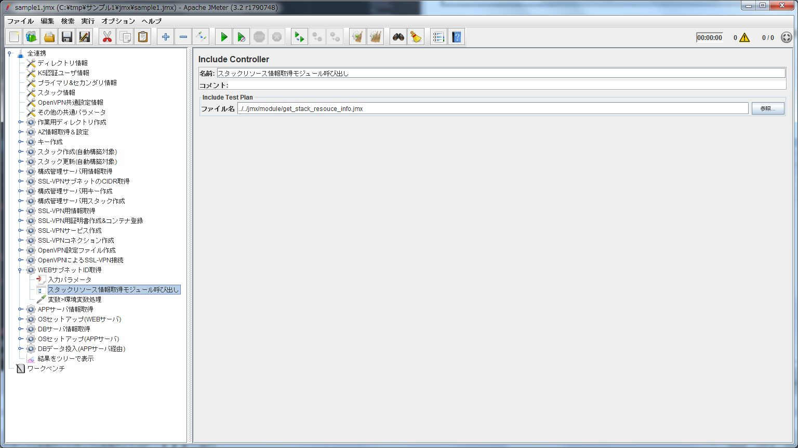

- 結果の取得
  JMeterの「BeanShellサンプラー」機能を使用して、処理結果を環境変数※に出力します。
  ※環境変数に出力する事で、工程間で値の受け渡しが出来るようになります。詳細についてはJMeterの公式ドキュメントを参照して下さい。

  以下は、取得した結果を環境変数「web\_subnet\_id」に出力する設定になります。
  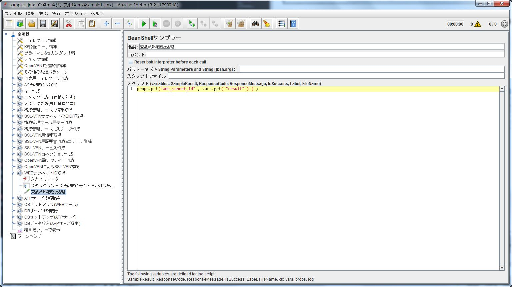

### 各エンドポイントからの情報取得

K5の各エンドポイントのAPIに対して、情報取得(GET)を行いたい場合は、以下のようにスレッドグループを構成します。
注意点として、情報取得が可能なAPIはJSON形式でレスポンスを返却するものに限られます。

- 環境変数からの入力
  JMeterの「BeanShellサンプラー」機能を使用して、環境変数から必要な値を取り出し、変数に格納します。
  情報取得に際して環境変数の値が不要な場合、この項目は不要です。

  以下は、「WEBサブネットのリソースID」を変数に格納する設定になります。
  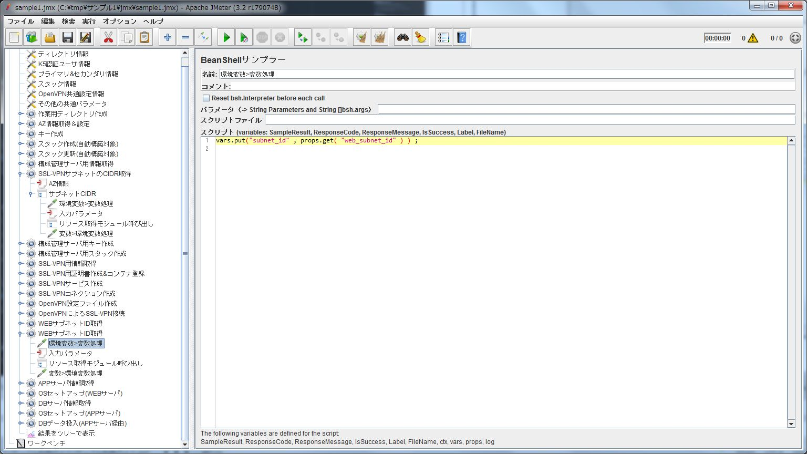

- 入力パラメータの設定
  以下のパラメータを設定します。

  - endpoint\_type：対象のエンドポイントタイプを指定
  - resource\_path：情報取得する(エンドポイントからの)APIのパスを指定
  - json\_path：JSON形式のレスポンスボディに対して取得得したいJSONPathを指定

  以下は、「WEBサブネットのCIDR」を取得する場合の入力パラメータの設定になります。
  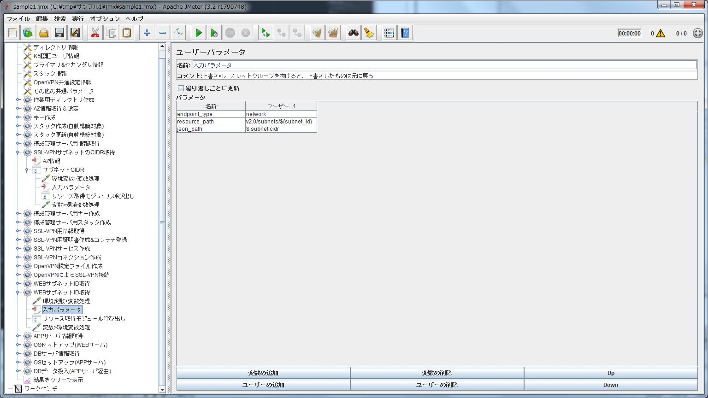
  この際、${subnet\_id}は「環境変数からの入力」で設定された値が指定されます。

- 部品の読み込み
  JMeterの「Incluede Controller」機能を使用して「module/get\_resouce\_info.jmx」を読み込みます。

  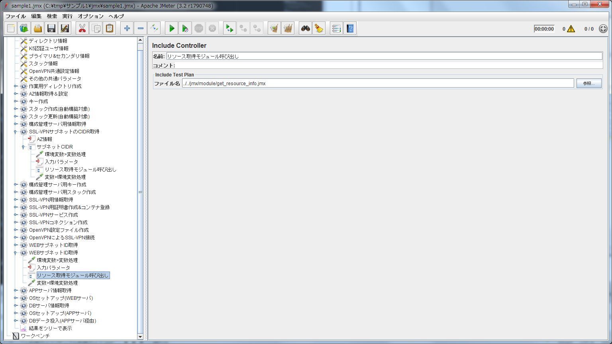

- 結果の取得
  JMeterの「BeanShellサンプラー」機能を使用して、処理結果を環境変数※に出力します。
  ※環境変数に出力する事で、工程間で値の受け渡しが出来るようになります。詳細についてはJMeterの公式ドキュメントを参照して下さい。

  以下は、取得した結果を環境変数「web\_subnet\_cidr」に出力する設定になります。
  

## 付録

### プロキシについて

JMeterから外部接続を行なう際に、プロキシの設定が必要な場合は、起動時に以下のオプションを追加するようにします。
> -H 【プロキシサーバのホスト名orIP】 -P 【プロキシのポート番号】 -u 【ユーザ名】 -a 【パスワード】

### CUIモードでの起動について

JMeterをCUIモードで起動する場合は、起動時に以下のオプションを追加するようにします。
> -n -t 【実行するjmxファイル】

### 複数のVPN接続について

OpenVPNを使用して複数のSSL-VPN接続を行なう場合は、事前に必要な数だけTAP-Win32アダプタを作成する必要があります。(Windowsのみ)
