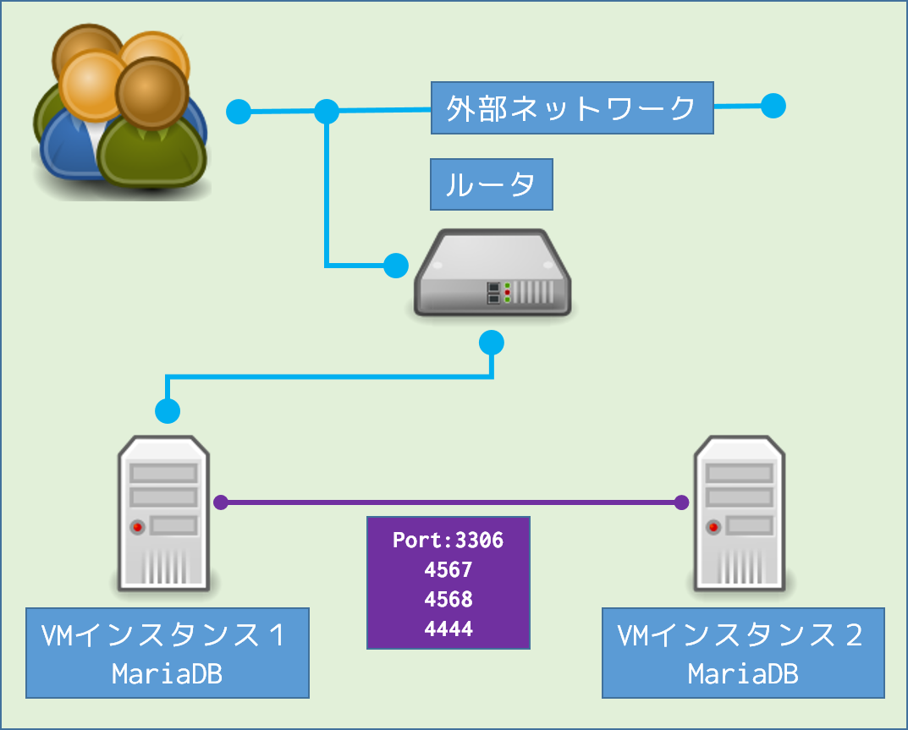

MariaDB Galera Cluster マルチインスタンス<br>テンプレート概要説明
====

<br>

### 概要

MariaDBを２つのインスタンスにインストールし、クラスタ化します。

<br>

### 作成されるシステムの構成図



<br>

### インスタンスの詳細

#### インスタンス１

|項目|内容|
|---|---|
|OS|CentOS 6.5 64bit|
|イメージタイプ|CentOS 6.5 64bit (English) 05|
|フレーバータイプ|S-1|
|ボリュームタイプ|M1|

<br>

#### インストールするソフトウェア

>|ソフトウェア|バージョン|ライセンス|説明|
>|---|---|---|---|
>|MariaDB|10.1|[GNU GENERAL PUBLIC LICENSE Version 2](https://mariadb.com/kb/en/mariadb/mariadb-license/)|MariaDB|

<br>

---

#### インスタンス２

|項目|内容|
|---|---|
|OS|CentOS 6.5 64bit|
|イメージタイプ|CentOS 6.5 64bit (English) 05|
|フレーバータイプ|S-1|
|ボリュームタイプ|M1|

<br>

#### インストールするソフトウェア

>|ソフトウェア|バージョン|ライセンス|説明|
>|---|---|---|---|
>|MariaDB|10.1|[GNU GENERAL PUBLIC LICENSE Version 2](https://mariadb.com/kb/en/mariadb/mariadb-license/)|MariaDB|

<br>

### 作成方法

1. トークンとorchestrationのエンドポイントを取得します。
1. 下記のフォーマットでパラメタファイルを用意します。<br>必要なパラメタを過不足なく指定します。<br>最後のパラメタには「,」が不要です。<br>パラメタの詳細は作成時パラメタを参照してください。
    ```
    "parameters": {
        "パラメタ１名": "値",
        "パラメタ２名": "値",
        "パラメタ３名": "値",
                  ・
                  ・
                  ・
        "パラメタｎ名": "値"
    }
    ```

1. スタックネームとHeatテンプレートファイルネームを指定し下記のコマンドでスタック情報ファイルを作成します。
    ```
    echo "{" > スタック情報ファイル
    echo "    \"stack_name\": \"スタックネーム\"," >> スタック情報ファイル
    echo -n "    \"template\":\"" >> スタック情報ファイル
    cat Heatテンプレートファイルネーム | \
        sed -e 's/\\/\\\\/g' | \
        awk -F\n -v ORS='\\n'  '{print}' | \
        sed -e 's/\"/\\"/g' | \
        sed -e 's/`/\\`/g' | \
        sed -e 's/\r/\\r/g' | \
        sed -e 's/\f/\\f/g' | \
        sed -e 's/\t/\\t/g' >> スタック情報ファイル
    echo "\"" >> スタック情報ファイル
    echo "    ," >> スタック情報ファイル
    cat パラメタファイル >> スタック情報ファイル
    echo -n "}" >> スタック情報ファイル
    ```

1. 取得したトークン ($OS_AUTH_TOKEN)、オーケストレーションのエンドポイント ($ORCHESTRATION)、スタック情報ファイルを以って下記のcurlコマンドを実行しスタックを作成します。
    ```
    curl -k -H "X-Auth-Token: $OS_AUTH_TOKEN" -X POST \
      -H "Content-Type: application/json" -H "Accept: application/json" \
      $ORCHESTRATION/stacks -d @スタック情報ファイル --verbose
    ```

<br>

### 作成時パラメタ

|パラメタ名|入力する値の型|説明|
|---|---|---|
|keypair_name|string|使用する証明書の鍵を指定|
|availability_zone|string|アベイラビリティーゾーンを指定|
|dns_nameservers|comma_delimited_list|DNSネームサーバを指定<br>`['xxx.xxx.xxx.xxx', 'yyy.yyy.yyy.yyy']`形式|
|network_id_mariadb_galeracluster1|string|インスタンス１が所属するネットワークIDを指定|
|subnet_id_mariadb_galeracluster1|string |インスタンス１が所属するサブネットIDを指定|
|network_id_mariadb_galeracluster2|string|インスタンス２が所属するネットワークIDを指定|
|subnet_id_mariadb_galeracluster2|string |インスタンス２が所属するサブネットIDを指定|
|remote_host_cidr|string|サーバへのSSH接続を許可するCIDRを指定|
|flavor|string|作成するインスタンスのフレーバーを指定|

<br>

### セキュリティグループ

#### インスタンス１

|プロトコル|ingress|egress|対象IPアドレス|ポート|
|---|---|---|---|---|
|ICMP                                |●|－|remote_host_cidr           |ICMP |
|ICMP                                |－|●|0.0.0.0/0                  |ICMP |
|SSH(TCP)                            |●|－|remote_host_cidr           |SSH  |
|HTTP(TCP)                           |－|●|0.0.0.0/0                  |HTTP |
|HTTPS(TCP)                          |－|●|0.0.0.0/0                  |HTTPS|
|TCP                                 |－|●|dns_nameservers,0          |DNS  |
|TCP                                 |－|●|dns_nameservers,1          |DNS  |
|UDP                                 |－|●|dns_nameservers,0          |DNS  |
|UDP                                 |－|●|dns_nameservers,1          |DNS  |
|TCP                                 |－|●|169.254.169.254/32         |HTTP |
|TCP（DB通信用)                      |●|－|ci-subnet CIDR      |3306 |
|TCP（DB通信用)                      |●|－|validate-subnet CIDR|3306 |
|TCP（DB通信用)                      |－|●|validate-subnet CIDR|3306 |
|TCP（クラスタレプリケーション通信用)|●|－|ci-subnet CIDR      |4567 |
|TCP（クラスタレプリケーション通信用)|●|－|validate-subnet CIDR|4567 |
|TCP（クラスタレプリケーション通信用)|－|●|validate-subnet CIDR|4567 |
|TCP（状態更新通信用)                |●|－|ci-subnet CIDR      |4568 |
|TCP（状態更新通信用)                |●|－|validate-subnet CIDR|4568 |
|TCP（状態更新通信用)                |－|●|validate-subnet CIDR|4568 |
|TCP（その他スナップショット通信用)  |●|－|ci-subnet CIDR      |4444 |
|TCP（その他スナップショット通信用)  |●|－|validate-subnet CIDR|4444 |
|TCP（その他スナップショット通信用)  |－|●|validate-subnet CIDR|4444 |

<br>

---

#### インスタンス２

|プロトコル|ingress|egress|対象IPアドレス|ポート|
|---|---|---|---|---|
|ICMP                                |●|－|remote_host_cidr           |ICMP |
|ICMP                                |－|●|0.0.0.0/0                  |ICMP |
|SSH(TCP)                            |●|－|remote_host_cidr           |SSH  |
|HTTP(TCP)                           |－|●|0.0.0.0/0                  |HTTP |
|HTTPS(TCP)                          |－|●|0.0.0.0/0                  |HTTPS|
|TCP                                 |－|●|dns_nameservers,0          |DNS  |
|TCP                                 |－|●|dns_nameservers,1          |DNS  |
|UDP                                 |－|●|dns_nameservers,0          |DNS  |
|UDP                                 |－|●|dns_nameservers,1          |DNS  |
|TCP                                 |－|●|169.254.169.254/32         |HTTP |
|TCP（DB通信用)                      |●|－|ci-subnet CIDR      |3306 |
|TCP（DB通信用)                      |●|－|validate-subnet CIDR|3306 |
|TCP（DB通信用)                      |－|●|validate-subnet CIDR|3306 |
|TCP（クラスタレプリケーション通信用)|●|－|ci-subnet CIDR      |4567 |
|TCP（クラスタレプリケーション通信用)|●|－|validate-subnet CIDR|4567 |
|TCP（クラスタレプリケーション通信用)|－|●|validate-subnet CIDR|4567 |
|TCP（状態更新通信用)                |●|－|ci-subnet CIDR      |4568 |
|TCP（状態更新通信用)                |●|－|validate-subnet CIDR|4568 |
|TCP（状態更新通信用)                |－|●|validate-subnet CIDR|4568 |
|TCP（その他スナップショット通信用)  |●|－|ci-subnet CIDR      |4444 |
|TCP（その他スナップショット通信用)  |●|－|validate-subnet CIDR|4444 |
|TCP（その他スナップショット通信用)  |－|●|validate-subnet CIDR|4444 |

<br>

### 出力情報

両インスタンスのIPアドレスを`http://xxx.xxx.xxx.xxx`形式で出力

<br>

### 起動方法

出力情報のインスタンス１IPアドレスにブラウザからアクセス

<br>

### その他

---
