# IaaSテンプレート利用ガイド

## 本書の目的

公開済みのIaaSテンプレートを使用して、スタックを作成する為の手順を示します。  

## 前提

K5上のアカウントが以下のロールを有している必要があります。

- 設計・構築者ロール(cpf_systemowner)※ロールについては機能説明書を、ロールの設定方法についてはAPIリファレンスを参照して下さい。

## 参考資料

- FUJITSU Cloud Service K5 IaaS 機能説明書
- FUJITSU Cloud Service K5 IaaS API リファレンス
- FUJITSU Cloud Service K5 IaaS API ユーザーズガイド
- FUJITSU Cloud Service K5 IaaS サービスポータルユーザーズガイド

## 手順

### テンプレートファイルのダウンロード
1. [テンプレート一覧のページ](https://github.com/k5-community/developer/tree/master/iaas-templates)を開きます。

1. 利用したいテンプレートファイルのリンクをクリックします。  
  例えば、apache_tomcat_single_c6_select.yamlを利用したい場合は、以下の赤枠をクリックします。  
  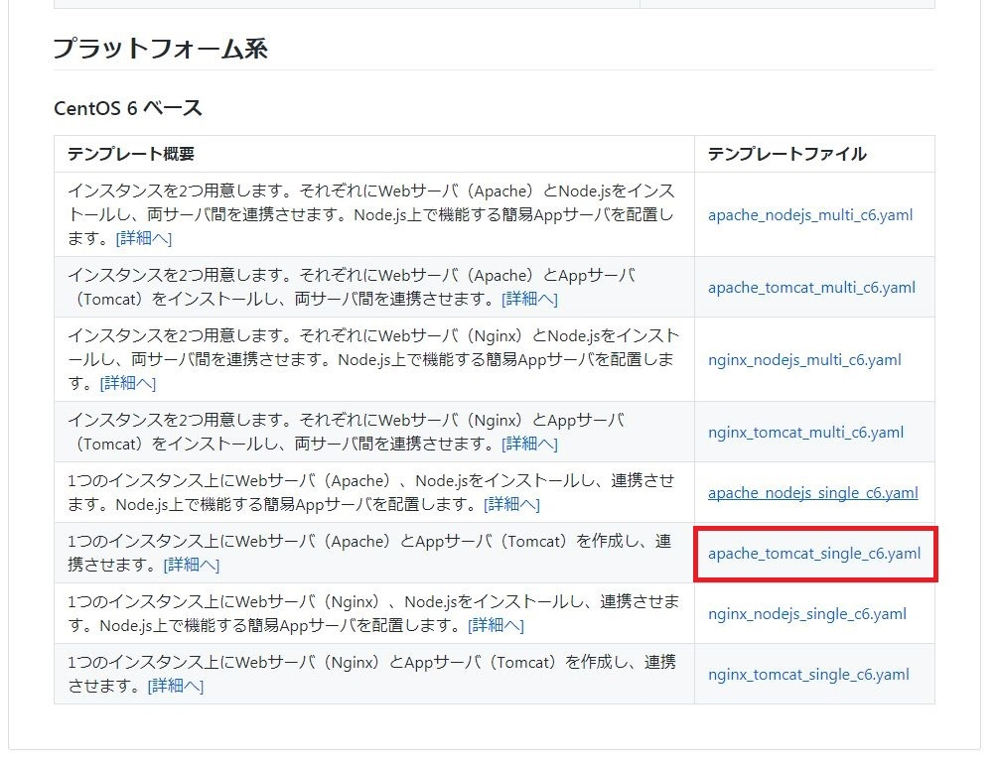

1. テンプレートのページが表示されるので、「Raw」を右クリック後、「名前を付けてリンク先を保存」を選択し、ファイルとして保存します。

### スタックの作成

1. K5のIaaSポータルにログインします。

1. 作成対象のリージョン及びプロジェクトを選択します。

1. メニューの「テンプレート＞スタック」をクリックします。  
  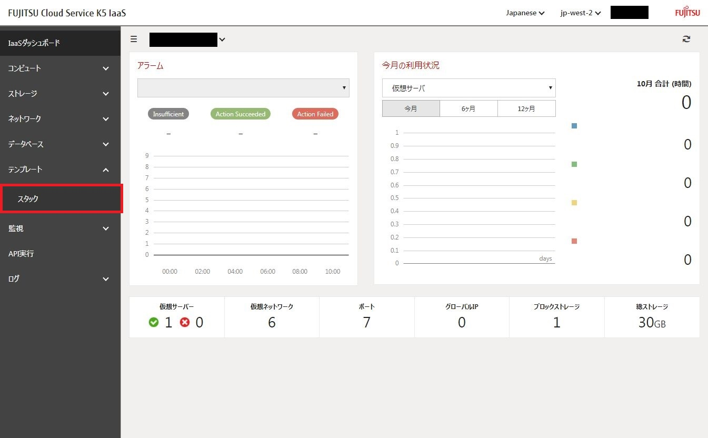

1. 右上の「＋」をクリックし、スタック作成画面を表示します。  
  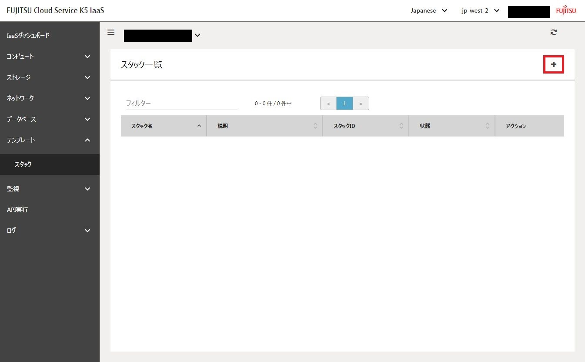

1. スタック名を指定します。既存のスタックと重複しないように注意して下さい。  
  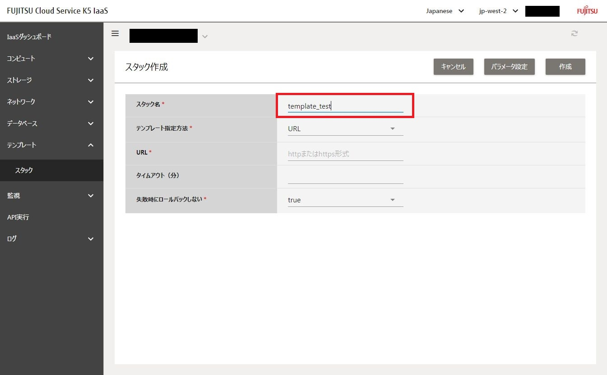

1. テンプレート指定方法でファイルを選択します。  
  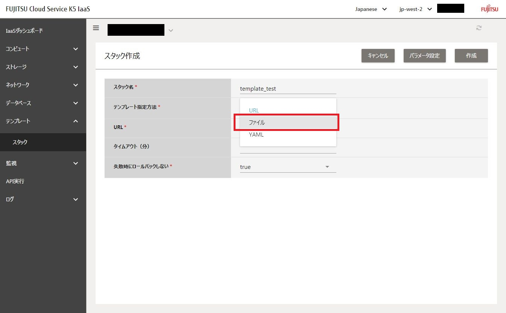

1. 「テンプレートファイルのダウンロード」で保存したファイルをドラッグ＆ドロップします。  
  

1. 右上の「パラメータ設定」をクリックし、パラメータ設定画面を表示します。  
  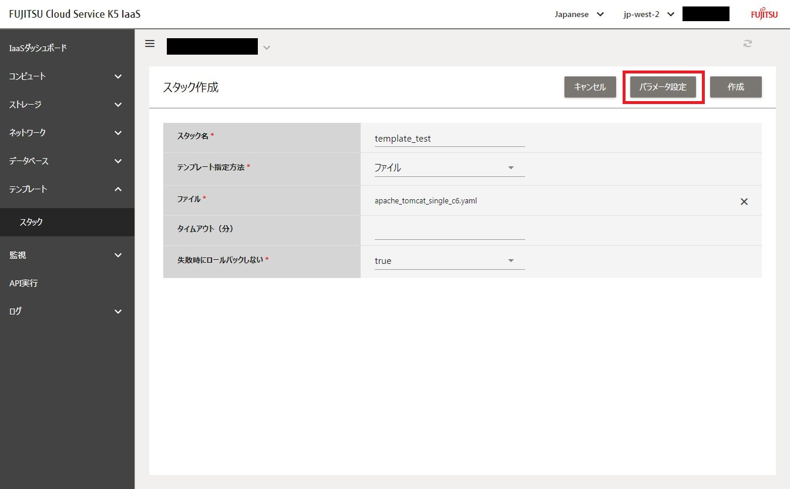

1. 各パラメータを入力します。  
  各パラメータの詳細については、テンプレート一覧から該当テンプレートの「詳細へ」をクリックし  
  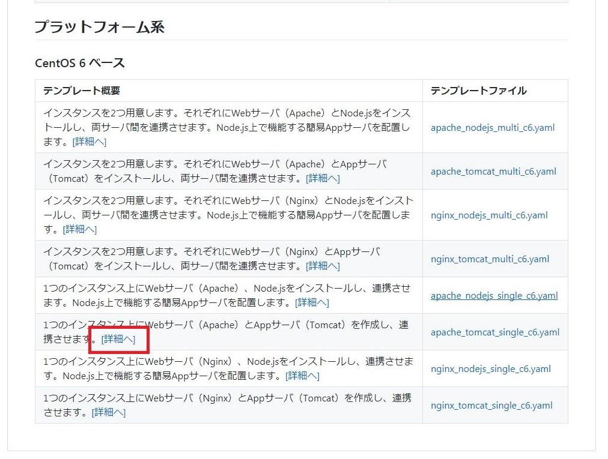  
  リンク先のテンプレート説明用mdファイル内の「作成時パラメタ」を参照して下さい。  
  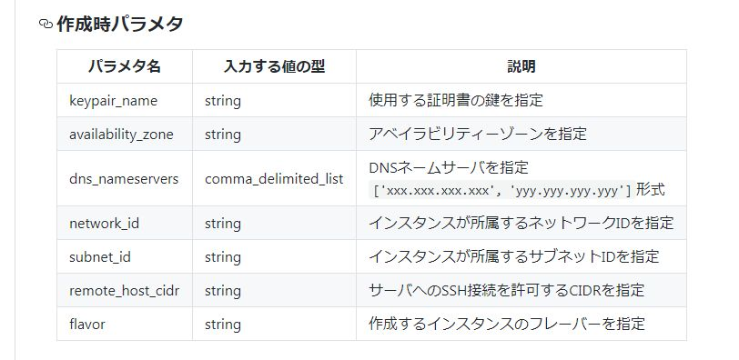  
  以下は、入力例になります。  
  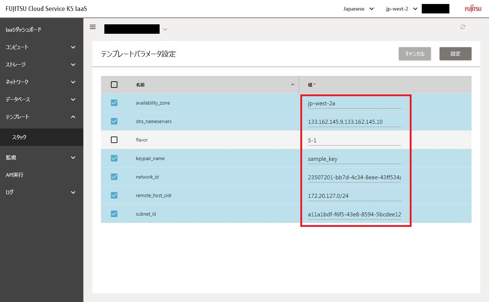  
  入力したパラメータはチェック状態にして下さい。

1. 「設定」をクリックします。  
  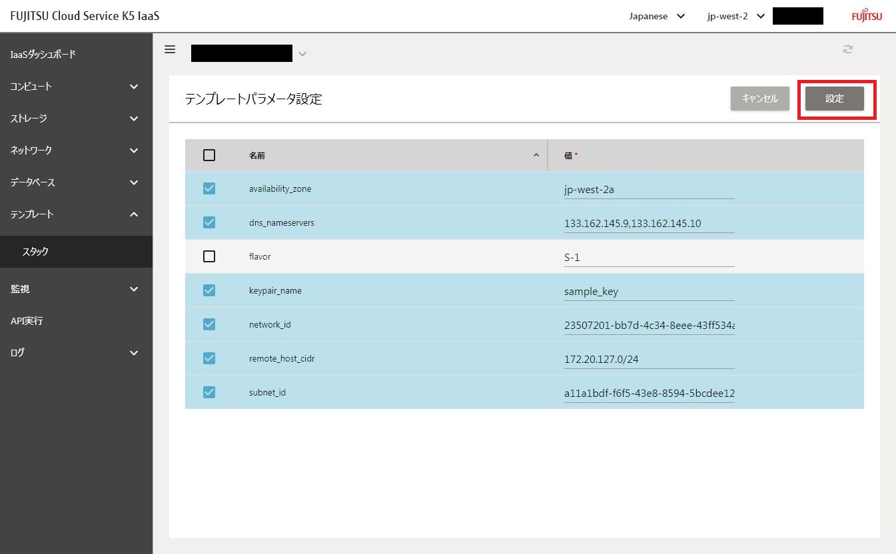

1. 確認メッセージが表示されるので、「設定」をクリックし、スタック作成画面に戻ります。  
  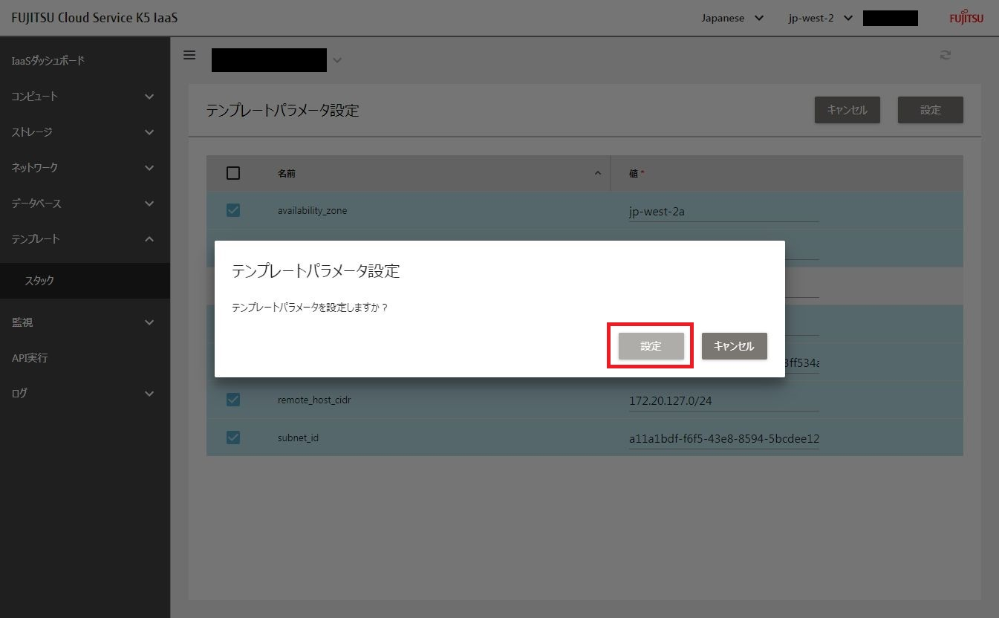

1. 右上の「作成」をクリックします。  
  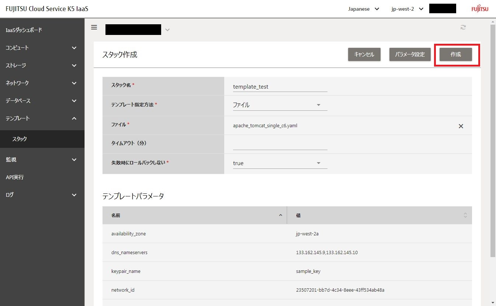

1. 受付完了のメッセージが表示されたら「閉じる」をクリックします。※表示まで時間がかかる場合があります。  
  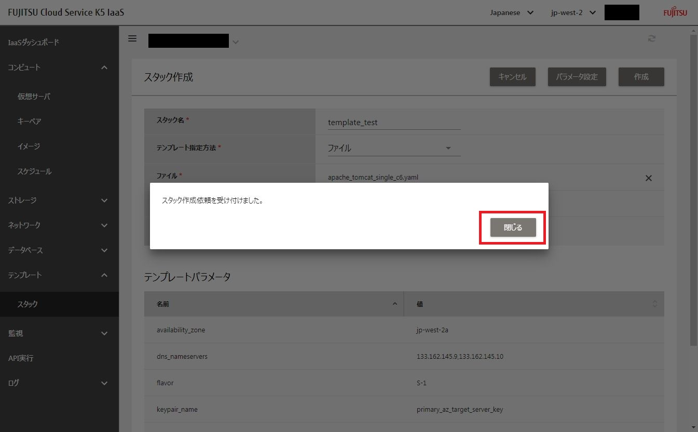

1. スタック一覧のページで、指定したスタック名のものが「CREATE_IN_PROGRESS」になっている事を確認します。  
  

1. 何度かページの更新を行い、「CREATE_COMPLETE」と表示されれば、スタックの作成が完了しています。  
  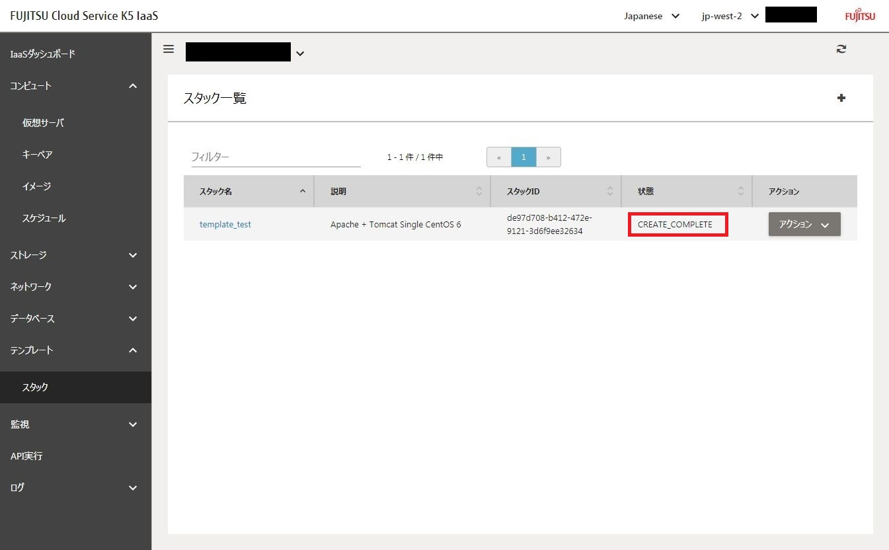
